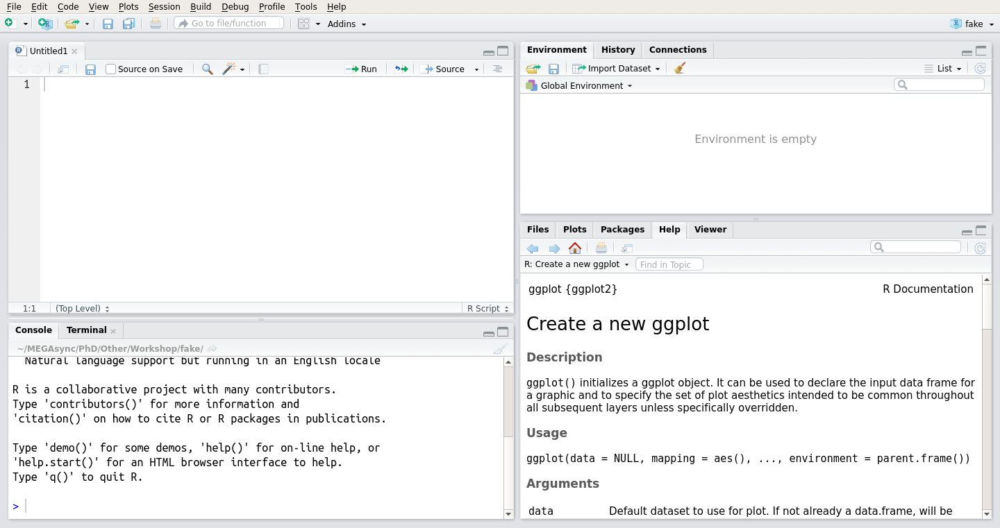
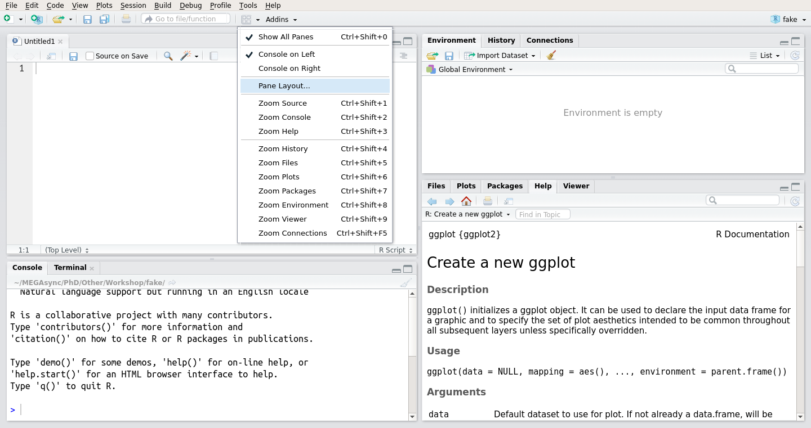
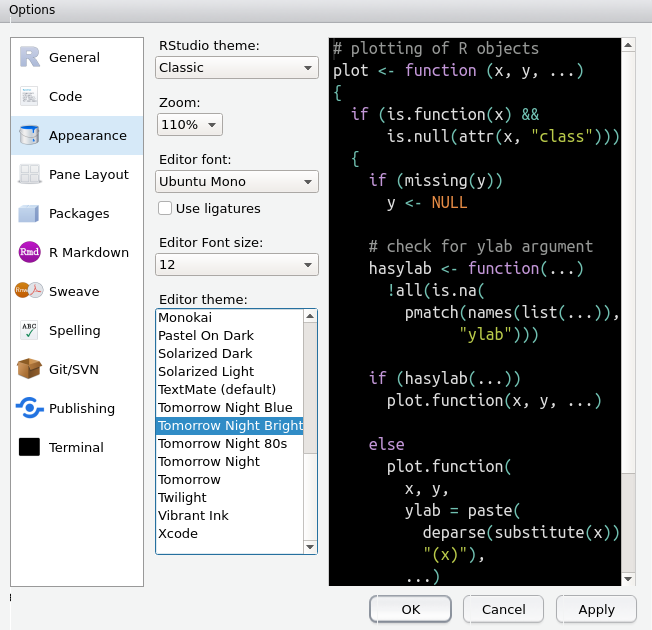

---

```{r setup, include=FALSE}
knitr::opts_chunk$set(echo = TRUE)
```

# Background
R is a statistical software that uses its own coding language. If you have coding experience you will realise that codes are quite similar across coding languages including the terminal or programs such as Mat lab. However, there are some basics that can differ. In my opinion, the learning curve in R has a long tail before reaching an exponential phase. Meaning that everyone struggles to understand it for some time in the beginning, especially if it is your first time coding. But you will experience a time when you just click to understand the basics and after that, R is yours. You can do whatever you want and it will become your most powerful tool. So do not get discouraged at first. It is perfectly normal that you have troubles to grasp the environment you are working with. A very bright side of R is the community you can find online. If you get stuck with a line of code, if you want to find a solution to an idea you have, just ask Google (e.g. "renaming files in R"). Probably there is someone who already asked the same question. You will find forums such as [stackoverflow](https://stackoverflow.com/) were users are extremely helpful.

So why should you use R? It's ...

* free
* open-source
* designed for data analyses and statistics
* extremely diverse and extensible
* helps to organise research with RStudio
* great online user-community

This introductory section might appear boring to most experienced R users. But you never now, R has so many sides that many people do not know even if they've been working in R for a long time! So give it a try. :)

---

# RStudio
## General
I recommend every beginner to start with R studio. R studio is a graphical user interface (GUI) for R, so it might be more intuitive to people who are not used to coding. A lot of actions can be executed by clicking through the interface instead of coding. However, I encourage everyone to not rely too much on the GUI, it will save you time in the long-run.

R studio looks like this, when you've freshly installed it:
<br>
<center>

</center>
<br>

R studio has four panels.

* Text editor (i.e. scripts)
* Console
* Global environment
* Multi-purpose panel

The *console* on the lower left is R (or also called "base R"). You would only see this window if you are solely using R not R studio. Working directly in the *console* is useful for running commands that you do not need to repeat. For example, looking at an object. You will notice a `>` on the left, which indicates whether a code that you've run has finished. If there is no `>`, it means that R is still computing. In cases where you have executed a code but forgot for example a bracket a `+` will appear. It means that R is waiting for more input. Either you find what is missing in your code and type it, or you can press `Esc` to quit executing the code. And re-run the complete code again. You can also press `Esc` if you want to interrupt an operation before it is finished.

Directly typing in the *console* is **not** useful for reproducible execution of an existing workflow or writing your own R script. Everything that is typed in the *console* cannot be saved. That's where the text editor comes into play.

The text editor on the upper left is where you can write your *script*. The main difference between the *console* and the editor is that when you press `Enter` in the *console*, the line of code your cursor was at will be executed immediately. But in the text editor you will jump to the next line. To execute a line from your *script* you have to move your cursor into the line you want to execute and press `Ctrl` + `Enter` (`Cmd` + `Enter` on Mac). Alternatively, you can mark/select a piece of your code and press  `Ctrl` + `Enter` (`Cmd` + `Enter` on Mac) in case you only want to execute a piece of your line.

After execution, you will see, that the same line appears in the *console* and you will see an output from R below. Another major difference is as mentioned earlier that the script can be saved for later manipulation and sharing with colleagues. Scripts are saved with a `.R` extension and can also be opened with any text editor on your computer.

If you do not see a script, you can create a new R script by `File > New File > R Script` or pressing `Ctrl` + `Shift` + `N` (`Cmd` + `Shift` + `N` on Mac). Or you can also open an existing script by `File > Open File > your_script.R`.

---

**Tip**: there are useful keyboard shortcuts. Some by default and others are customisable. You can see all the keyboard shortcuts through `Alt` + `Shift` + `K` (or `Tools > Keyboard Shortcuts Help`). And you can add/modify keyboard shortcuts by `Tools > Modify Keyboard Shortcuts`.

---

Then you have a panel with the R *global environment* on the upper right. The *environment* contains basically every object that you have created in R within a session. I will come back to that later in the next section.

Then another multi-purpose panel on the lower right that shows plots, help files, packages that you've installed and also a `Files` panel through which you can see all files on your local computer. The example on the picture above shows a help file.

---

## Customisation
Now, R studio is quite customisable. I personally do not like this configuration of panels, you can easily switch by using the panels icon  on the upper left.

By selecting 'Pane Layout ...', you can select whatever configuration you want.
<br>
<center>

</center>
<br>
I prefer to switch the *global environment* with the *console*, so it looks like my script and the console are communicating next to each other. It's all a personal preference, you can leave it as it is or pick whatever configuration you like.

---

# Common errors when coding

R is **case sensitive** (meaning a capital letter differs from a small letter) and **hates spaces**. So try to avoid spaces as much as possible. Replace spaces by `_` or `.`. 

Probably the most common mistakes in the beginning are related to typing such as:

* misspelling
* mixing of capital letters
* wrong brackets
* wrong indexing (we'll go through this in Section 1)

So, basically the main error are typos. That's why I recommend another customisation in RStudio, which is to change the colour of the text editor. You can edit the appearance through `Tools > Global Options ... > Appearance`.
<br>
<center>

</center>
<br>
You can pick a colour combination that you prefer. Besides training your typing skills, more important is to train your eyes to spot your typos. The colour adds an aid in finding these common errors more easily.
However, colours do not help finding case sensitive typos, either avoid using capitals at all or keep aware when you use them.

---

# R extensions: Packages

We shortly mentioned that R is extremely extensible. The reason is the thousands of *packages* that are available. Packages are a collection of R functions, data and code that we can install and use. Think of them as plug-ins. All packages are free and were created by informaticians, biologists, ecologists etc. You could make one too. Some packages can be very new and buggy but every package includes the author, so if you have problems with some codes you can always contact them.

Installing R and RStudio does not automatically give you all R packages, only a few that are considered too be part of `base R`. You will probably not use most of the packages, as many packages are field specific. R packages are uploaded and available on the [CRAN](https://cran.r-project.org/) repository. Each package has a description PDF that you can read online. Each description/manual explains the *functions* and how to use them.

---

## Installing and using packages
Installing a package requires the use of the function `install.packages()`.

Functions can be distinguished from R objects by ending with brackets `( )`.
They are formulated like this:
```{r, eval = FALSE}
function_name(arg1 = val1, arg2 = val2, ...)
```

See what happens if you would run `install.packages` without the brackets.
```{r, tidy = TRUE, eval = FALSE}
install.packages
```

The function will not work as a function. But, it will give you what that object you called is. R is clever enough, it knows it is a function and it tells you that it is a function of the package `base`. It actually also prints how the function is written. That's why the output is so complex. But do not bother about the content of the function for now.

Let's move on and install a package that we will use later. `ggplot2` is a visualisation package that is quite powerful and has become more and more popular. Note that you have to place the package name in quotes `" "`. Otherwise, the function will not work.

```{r, tidy = TRUE, eval = FALSE}
install.packages("ggplot2")
```

Now, `ggplot()` is the core function of this package. Let's call it without the brackets:
```{r, error = TRUE}
ggplot
```
You'll see that it tells you that no such thing as `ggplot` exists in your environment. Why? Simple, you installed the package but you haven't loaded it into R yet. A package has to be loaded into R every time a new R session is started.

To load the package into the R environment you have to call it by:
```{r}
library("ggplot2")
```
Now, let's try the same command again.
```{r}
ggplot
```
Yes, it tells you that it is a function and it belongs to the package `ggplot2`. Now, if you want to know how the function works you'll add a question mark infront of the function name. Executing this command opens the help file of the function.
```{r}
?ggplot
```
After you've run this command, take a look at the help file. Reading help files may appear difficult at first. The first line indicates the function name and which package it belongs to in `{ }` brackets. You'll have a description of what it does and then the **Usage** section is the most important. It tells you what kind of *arguments* the function uses (infront of each `=`) and what the default inputs for the *arguments* are. This is the key to using any function. If you further scroll down to the bottom, each function has a working code in the **Examples** section that you can directly copy and paste into the *console* to see how it works, to examine what you might be missing to make the function work.

If you remember the function but forgot what package it belongs to, you can let R search not only the environment but everything there is online with `??`.
```{r}
??ggplot
```

One important thing to know is that some functions have the same name across packages. In such cases, add the package name infront of the function `base::data.frame()`.

---

**Tip**: It is a good practice to load all required packages at the beginning of each script. This not only helps people who use your script to know what packages they need to install or load but also helps you to keep an overview of what packages you are using rather than searching your whole script for packages in case you encounter errors.

---

You can check the package details with
```{r, tidy = TRUE}
packageDescription("ggplot2")
packageVersion("ggplot2") # only the version
```

---

## Acknowledging
Now, R is a free software and the only way to acknowledge the hard work of the developers and the package creators is to cite them in your publications. I strongly insist on everyone doing this as a matter of principle.

You can find information how to cite R, RStudio and packages with:
```{r, error = TRUE}
citation("ggplot2") # for packages
citation() # to cite base R
```
```{r, eval = FALSE}
RStudio.Version() # to cite R studio
```

---

## My acknowledgements

I'll also take the chance here to acknowledge all my R teachers.
[Stefan Dullinger (University of Vienna)](http://cvl.univie.ac.at/department/Staff/staff_detail.cfm?Nachname=Dullinger), [Johannes Wessely (University of Vienna)](http://cvl.univie.ac.at/department/Staff/staff_detail.cfm?Nachname=Wessely&Vorname=Johannes), [Robert Ptacnik (WasserCluster Lunz)](https://aquascalelab.wordpress.com/members/robert-ptacnik/), [Gabriel Singer (IGB)](https://www.igb-berlin.de/en/singer) and especially [Tom W.N. Walker (UNIL)](https://scholar.google.com/citations?user=pCqEWrEAAAAJ&hl=en). The "R basics tutorial" is almost 100% Tom's creation and was the best introductiory course to R that I have ever taken.

---

This was an introduction into principles of R and RStudio. Let's start to learn the basics of the language in Section 1.
