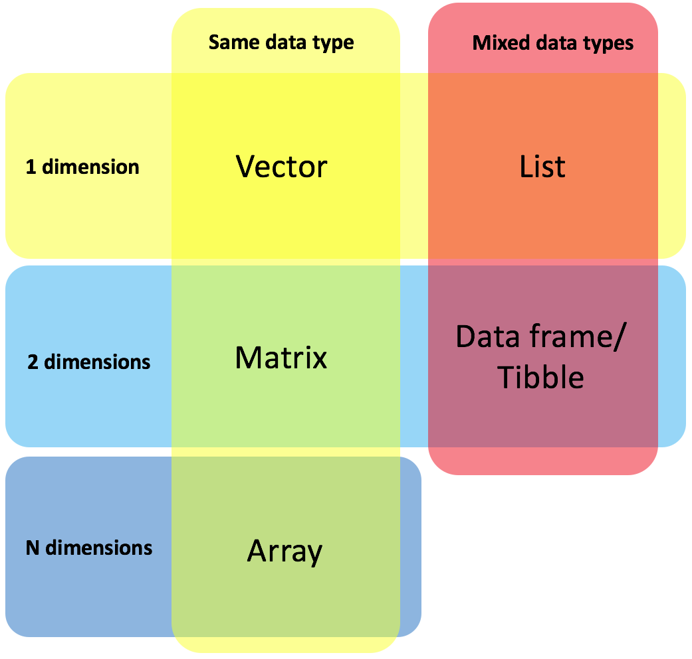

---

```{r setup, include=FALSE}
knitr::opts_chunk$set(echo = TRUE)
```

---

This tutorial is based on and adapted from an internally given workshop created by [Dr. Tom W. N. Walker](https://scholar.google.com/citations?user=pCqEWrEAAAAJ&hl=en) at the [Terrstrial Ecosystem Research Division](http://ter.csb.univie.ac.at/) of the University of Vienna in 2016.

<a rel="license" href="http://creativecommons.org/licenses/by/4.0/"></a>

This tutorial is licensed under a <a rel="license" href="http://creativecommons.org/licenses/by/4.0/">Creative Commons Attribution 4.0 International License</a>. 

*Share, adapt, and attribute please!*

---

# Basics of the R language
In this section we will learn the very basics of R and how to communicate with it.

## The R environment
So let's play in the *console* first. This is the most direct way of interacting with R by typing commands directly into the *console*. Pressing enter provokes an immediate response.
```{r}
3
```

Here, we told R the object '3', which resulted in the *console* echoing it. The '[1]' in the front shows that 3 is the first element in the object. This will make more sense later.

It is important to keep notes on codes that you are executing as you write your *scripts*. Even if you are the author of a *script*, you easily loose track of what the codes you've been executing actually do. Especially, if you have more complicated, sequential operations. Therefore, it is possible to annotate a code without R executing it. This is done by inserting a `#` in-front of your code, it tells R to ignore it.
```{r}
# my favourite number
3
```

All 'normal' mathematical operations can be coded in R, such as:
```{r}
10 + 2 # addition
10 - 2 # subtraction
10 * 2 # multiplication
10 / 2 # division
10 ^ 2 # exponentials
```
So basically, R can be your sophisticated calculator, too. However, if you run those calculations in this way, the output of the computation is not saved in any way. For example:
```{r}
(10 + 2) / 2
```
If you just quickly want to know what the calculations' result is, there is not a problem at all. However, you can easily think of situations were the output is needed for a future calculation. The solution is to store the result by giving it a name. You do so by assigning an empty object to your operation.
```{r}
a <- (10 + 2) / 2
```
The arrow shows that the output of the operation is being assigned to `a`. This object is then saved in the R *global environment*.

---

**TIP**: Pressing `ALT` + `-` in R studio will create an arrow for you.

---

Notice, that executing this code will not print the output. You have to ask for this separately.
```{r}
a
```

---

**TIP**: You can put your line of code in brackets, then it will print the output of the code in the console without typing your object (e.g. `a`) again. 
```{r}
(a <- (10 + 2) / 2)
```

---

This object `a` can now be used in downstream calculations as if it is a number. And the result of that can be stored again.
```{r}
a / 2        # use it as a number and print the output
```
```{r}
b <- 2       # assign another number to an object 'b'

c <- a / b   # assigning the output of this calculation to 'c'
c            # printing it
(c <- a / b) # short version
```
Note that the objects must exist in the environment before they can be used in an operation.
```{r, error = TRUE}
a + z
```
It is easy to check what objects exist in the environment by using
```{r}
ls()
```
The function stands for list. So basically you are telling R, list me all the objects that are there in the environment.

---

**TIP**: All objects currently existing in your R *global environment* will also appear in the *global environment* panel in RStudio.

---

If you want to remove an object from the environment, use the `rm()` function.
```{r}
rm(a)
```

---

**Tip**: Move your cursor into the console and press the up arrow on your keyboard. It will show previous codes that you have run. Use the down arrow to navigate back. If you want to repeat a code without typing it again, this is very helpful.

---

# Data types

In R we can have several kind of data types, also called *classes*. They are particularly important as they determine how an object is dealt with by a function or operation. There are four classes:

1. **Numeric** - a number
2. **Character** - a string of text or symbols (easily identified as they are surrounded by `" "`)
3. **Factor** -  a string of text with meaning (weighted by numbers) (e.g. small, medium, large are strings of text but have a meaning to us. We can assign meaning with numbers (small = 1, medium = 2, large = 3) so that R knows that those strings have levels)
4. **Logical** - a TRUE or FALSE statement (here the capitals are important!)

All of this becomes more obvious once we use them, so let's start:

---

# R objects

## Vectors

A *vector* is an object that is made up by one or more elements, with two important properties. First, it is **one-dimensional** - meaning that it is just a sequence of values without rows and columns. Second, it is **atomic** - meaning that the elements can only belong to **one** data type (or *class*).

In order to create a vector it is necessary to assign values (one or more) to one object. This is done by listing them and combining them with the function `c()`. The `c()` function is probably the most frequently used function in R, and you can think of it as a `c` for *combine*. 
```{r}
a <- 1 # vector, with one value
a
numbers <- c(1, 2, 3, 4, 5, 6, 7, 8, 9, 10)  # numerical vector with many values
numbers
```
Here, we have assigned all integers between 1 and 10 to the `numbers` object. Another way of defining such a sequence is to name only the first and last numbers, separating them with a `:`.
```{r}
numbers <- 1:5 # numerical vector with many values
numbers
```
Note here, that we also have overwritten the previous `numbers` vector. So sequence in R does matter a lot! Be careful about that.

We can see how many elements are contained in a vector by using the `length()` function and determine its class with `mode()`:
```{r}
length(numbers)
mode(numbers)
```

As mentioned before, classes are very important in R. The object `numbers` is numeric, which allows us to use it in numerical operations:
```{r}
numbers
numbers + 5 # addition with a vector
```
You will see, to each element in the vector we have added 5.
```{r}
another.numbers <- 31:35
numbers + another.numbers # adding two vectors
```

---

To create a vector with **characters** you have to surround the text strings by quotes `" "`. The quotes differentiate the text from objects that exist in the *environment*.

```{r}
c.vector <- c("hello","R", ",", "you","are","awesome")    # character vector
```
You can use the same functions as for the numeric vector to inspect it.
```{r}
length(c.vector) # vector has 6 elements
mode(c.vector) # class is character
```

Notice what happens when you don't put the text in quotes:
```{r, error = TRUE}
c.vector <- c(hello,"R", ",", "you","are","awesome")
```

If a string of text is not in quotes, R thinks of it as an object that is in the *global environment*. Since we never assigned something to an object called `hello`, R returns an error.

Note that you cannot perform numerical operations to character vectors, which would be meaningless anyway.
```{r, error = TRUE}
c.vector + 5
```

---

Finally, **logical** vectors contain elements that are **TRUE** or **FALSE** statements (i.e. Boolean operators). Notice that when you type them (with CAPITALS) in R, you'll see that the text colour changes. Meaning that R already recognises them as logical statements. To avoid confusion, never create objects that you name `true` or `false`, even if they are in lower cases. Logical statements are vital for checking outputs of operations and finding particular elements in data sets - so you will be using them quite a lot.

```{r}
bool <- c(TRUE, FALSE, FALSE, TRUE, FALSE)
bool
```
```{r}
mode(bool) # class
```

As mentioned, logical operators are very common and extremely helpful. As a simple example, we can test conditions of numeric objects by making logical statements about them:
```{r}
# creating some random vectors
x <- 1
y <- 2
z <- 3

# testing statements about them
x > 2 # is the object greater than ...?
y > 2
z < 2 # is the object smaller than ...?

y >= 2 # is the object greater than or equal to ...?
x == y # is the object equal to ...?
x != y # does the object not equal to ...?
```

---

**TIP**: Assigning objects in R can be done with ` <- ` and alternatively with ` = `. Now, I think you can see the potential problems of using ` = ` for assignments. First of all, ` = ` is used in functions to separate *argument* names and their input. Secondly, you could confuse it with the logical statement of ` == `, meaning equal to. So, I recommend to use the arrow, and don't forget that there is the keyboard shortcut of `Alt` + `-` to create a ` <- `.

---

Vectors can also hold extra information about the elements contained in them, called **attributes**. For example, we can name the elements of `numbers`by using the function `names()`.
```{r}
# create a vector with names for the numbers
number.names <- c("A","B","C","D","E")

# assign to the numbers
names(numbers) <- number.names
numbers
```

---

I will not go into detail about factors for now. Later, I will show you how they can be useful.

---

## Practice

Why does this code not work?
```{r, error = TRUE}
my_variable <- 10
my_varıable
```
Look carefully! (This may seem like a pointless excercise, but trust me, training your eyes will pay off!)

---

## Hierarchy of classes

As mentioned earlier, a property of vectors is that you can only have **one** data type. Meaning a vector can only have numeric, character, logical or factor elements. Mixing of those in a single vector is not possible. However, if you do combine them, R will actually not give you an error but instead unifies them into one single data type. R has a hierarchy in data types. Which is **Character > Numeric > Logical**.

Meaning that if you have a single character in a vector with other data types, everything becomes a character.
```{r}
numbers.wrong <- c(1, "hello")
mode(numbers.wrong)
bool.wrong <- c("hello", FALSE, TRUE)
mode(bool.wrong)
bool.wrong.2 <- c(1, FALSE, TRUE)
mode(bool.wrong.2)
```

We have to keep this always in mind, especially, if you want to change the classes of vectors.
```{r, error = TRUE}
as.character(numbers) # numbers can become just "letters", so this is ok
as.numeric(letters) # this is NOT possible, letters do not make sense as numbers
as.logical(letters) # again, this is NOT possible as there is no intuitive conversion
```

---

## Recycling principle
If two vectors have the same length meaning that they contain the same number of elements, calculations between them will be performed by their position in the object.
```{r}
low.numbers <- 1:10
high.numbers <- 11:20
low.numbers * high.numbers
```
However, if they are not the same length, R utilises the recycling principle. Meaning once it hits the end of one vector, it will repeat the shorter vector until the longer vector ends.
```{r}
numbers
numbers + 5
```
Here, `5` is a single element that is applied to a vector with five elements. You can see that R recycled the number `5` across the length of the longer vector. This is intuitive but important to keep in mind, especially for more complex operations.

```{r}
(two.elements <- c(0, 50)) # creating a vector with two elements

# adding this vector to our 'numbers' vector
numbers + two.elements
```
Here, the two element vector was recycled, too. This is called the *recycling principle* and applies to every operation where the length of one vector does not equal another.

---

### Indexing
Probably the most important tool in R is **indexing**. It is the process of identifying and isolating certain elements in an object. There are three ways to do this in vectors, which are all useful in different situations.

In all cases, elements in the object are selected by using square brackets `[ ]` after the name of the object. 

---

The first option is indexing by **position**. It's simply selecting elements based on their position in a vector. 
```{r}
c.vector[2] # second element
c.vector[4:6] # multiple
c.vector[c(1,4)] # multiple, but not continuous
c.vector[c(1,4:6)] # muliple, combining single and continuous
```
For longer vectors, you will see it is hard to know which position your elements of interest occupy. Do you remember the `[1]` that R gives us in-front of a vector? This is the key to finding the position of your element.

```{r}
(long.vector <- 1:100)
```
You see here, that the square brackets indicate the position of the first element for each row printed in your *console*. You can use this to find the position you'd like to index.

<br>

Now, if you want to exclude elements you can put a `-` in-front of the position.
```{r}
c.vector[-2] # exclude second element
c.vector[-c(1,3)] # exclude first and third elements
c.vector[-c(1:3)] # exclude continuous elements
```
Note that if you have multiple positions, you always have to *combine* them with `c()`.

---

Another way of position indexing is, assigning numbers to objects and putting them in the square brackets. You will see, that this becomes a very powerful tool.
```{r}
vec.positions <- c(1,4)
c.vector[vec.positions]
```

---

Now, the second way of indexing is by **name**. Do you remember that vectors can have attributes, such as names to each position?
Let's re-use that vector with numbers and alphabets as their attributes.
```{r}
numbers
numbers["A"] # single element
numbers[c("A","E")] # multiple elements
```
Note here, that those names have to be in quotes and upper or lower case matters!
```{r, error = TRUE}
numbers["a"]
```

---

The final and probably most powerful way of indexing is by **logicals**. With logicals, we can exclude or include elements based on certain conditions. With our simple vectors, it might appear less useful, but let's create a new vector that represents for example the depth of different lakes named with alphabetic letters.
```{r}
depth <- c(7.5, 30, 105, 0.1, 50, 25, 3.2, 300, 15, 27, 36, 16, 18, 21, 2)
names(depth) <- c("a","b","c","d","e","f","g","h","i","j","k","l","m","n","o")
depth
```
Now the depth vector clearly has some anomalies that we might want to remove if we are interested in less deeper lakes.
```{r}
(too.deep <- depth > 100) # a logical statement testing our condition

# identifying those lakes using the statement
depth[too.deep]
# excluding these lakes
depth[!too.deep]
```
Or alternatively, you can create a logical statement with the elements that you are interested in.
```{r}
(shallow.enough <- depth < 100)
depth[shallow.enough]
```

Looking at the data, we might want to also remove the lowest value of 0.1, because we suspect something is wrong with this lake measurement. We can do this also with a logical statement. When including more than one condition, we need to combine the conditions with additional operators for **and** `&` and **or** `|`.

So, we can combine logical statements to select our data.
```{r}
(anomalies <- depth > 100 | depth < 1) # bigger than 100 OR smaller than 1
depth[!anomalies] # exclude those values
# Or selecting the good values by
(good <- depth < 100 & depth > 1) # smaller than 100 AND bigger than 1
depth[good] # exclude those values
```

We then usually assign this output to a new object so we can save our selection for downstream processing.
```{r}
(good.data <- depth[good])
```
However, in certain conditions it might be wiser to modify the vector itself by assigning a null value `NA` for the anomalies. If we modify the original data in such a way, we know that these values existed but we decided to exclude them.
```{r}
depth[anomalies] <- NA
depth
mode(depth) # NA values will not change the class of the vector
```

For some functions, NAs are problematic. Often there are *arguments* in a function such as `na.omit`, but sometimes we need to exclude them manually. You can do this with `is.na()`.
```{r}
nas <- is.na(depth)
(also.good.data <- depth[!nas]) # exclude data with NAs
```

---

### Challenge #1:

We have measured the depth of 10 lakes in spring and summer.

```{r table2, echo = FALSE, message= FALSE, warning = FALSE, results= 'asis'}
tabl <- "
| Lake | Spring (m) | Summer (m) |
|:----:|:----------:|:----------:|
| A    | 23.2       | 22.5       |
| B    | 23.0       | 21.1       |
| C    | 30.1       | 26.8       |
| D    | 39.4       | 31.6       |
| E    | 24.2       | 22.7       |
| F    | 29.1       | 25.3       |
| G    | 31.7       | 26.8       |
"

cat(tabl)
```


1. Create two vectors of lake depth – one for the spring and one for the summer.
2. Name the vectors with the corresponding season.
3. Find the mean depth for the spring and summer using the function `mean()` and the maximum and minimum depth fot the spring and summer using the functions `max()` and `min()`.
4. Put the depths in spring in ascending order. Try indexing with the function `order()`. (*Hint*: this is a two-step process)
5. Which lakes are deeper than 30 m in spring?
6. Which lakes are deeper than 25 m AND shallower than 30 m in summer?
7. Calculate the percentage change in depth for each lake between the two seasons: `% change = ((spring / summer) - 1)* 100`

*Solutions* are at the bottom of this document.

---

## Matrices

A *matrix* is an object that is fairly similar to vectors, just that it is **two-dimensional** - meaning that it is a table of elements containing rows and columns. Similar to vectors, it is **atomic**, too - meaning that the elements can only belong to **one** data type (or *class*).
You can think of them as multiple vectors combined into a table. Therefore, indexing in matrices basically works the same way as for vectors, just that you have to take care of its multi-dimensionality. 

The simplest way of creating a matrix is with `matrix()`.
```{r}
numbers <- 1:10 # a vector of numbers
(a <- matrix(numbers))
```
Note that the default is to put the elements of a vector into a single column rather than rows. So `a` is a matrix with a single column and 10 rows. We can manipulate this format by including additional *arguments* in the function. *Arguments* are essentials of functions with which we can specify what we want the function to do. You can easily find what kind of *arguments* are used in a function by calling the help file of the function. Calling the help file is as simple as putting a `?` in-front of the function.

```{r}
?matrix()
```
I've mentioned this in the general intro, but I'll just repeat myself because it is truly important:

Reading help files may appear difficult at first. The first line indicates the function name and which *package* it belongs to in `{ }` brackets. You'll have a description of what it does and then the **Usage** section is the most important. It tells you what kind of *arguments* the function uses and what the default inputs for the *arguments* are. This is the key to using any function. If you further scroll down to the bottom, each function has a working code in the **Examples** section that you can directly copy and paste into the *console* to see how it works, to see what you might be missing to make the function work.

Now, we see that in the `matrix()` function there is an *argument* with which we can specify the number of columns in a matrix with `ncol = `.
```{r}
(b <- matrix(numbers, ncol = 2)) # a matrix with two columns
```
You see that the numbers vector was split into half to fill two columns in our matrix.
```{r}
(c <- matrix(numbers, ncol = 5)) # matrix with five columns
```
So in both cases, R has added the elements to the matrix by **column**. Now, if you want to add the elements by **row**, you can do this by using another *argument* `byrow = `. *Arguments* are separated from each other by a `,`.
```{r}
(d <- matrix(numbers, ncol = 5, byrow = TRUE))
```
So the result here has five columns, but rather than filling the values from column to column, it fills them by rows.

Similar to vectors, we can examine the mode of a matrix and also its length (returns the total number of elements in a matrix). However, if we are interested how many columns and rows the matrix has, we can use the functions `ncol()` and `nrow()`, respectively.
```{r}
mode(d) # what class?
dim(d) # how many dimensions?
ncol(d) # number of columns
nrow(d) # number of rows
```

Another way of creating matrices is by combining vectors together using row and columns binding functions `rbind()` and `cbind()` functions, respectively.
```{r}
# creating vectors to bind
v1 <- c(12.5, 11.1, 6.8, 21.6, 12.7, 15.3, 16.8)
v2 <- c(13.2, 13.0, 20.1, 29.4, 14.2, 19.1, 21.7)

# binding to create a matrix
(mat.rows <- rbind(v1,v2)) # by row
(mat.cols <- cbind(v1,v2)) # by column
```

You'll see that by default, the column names in the case of `mat.cols` are the objects names, which are `v1` and `v2` in our case. And in the `mat.rows` case, they become the row names.
We can change this similarly to attributing names in vectors just by specifying whether you want to name the rows or columns with `rownames()` and `colnames()`, respectively.
```{r}
lakes <- c("A", "B", "C", "D", "E", "F", "G")
rownames(mat.cols) <- lakes
colnames(mat.cols) <- c("Summer","Spring")
mat.cols
```

We can get a summary of our matrix with the `str()` function.
```{r}
str(mat.cols)
```
It tells us that the matrix is numeric with seven rows `[1:7,]` and two columns `[,1:2]`. Note that this is similar to our vectors, but now we have two *arguments* inside the square brackets. The first is the row and the second is the column, separated by a `,`. This is a visual version of it: `object[row, column]`. This will be the basis for indexing in matrices.

Besides the rows and columns, the *structure* `str()` function tells us that both rows and columns have been named with characters and we can get the first examples of the names. This function is one of the most important, especially once the objects become more complicated. So it is good to familiarise oneself with it!

---

### Indexing in matrices

```{r}
b
```
Printing an unnamed matrix returns its elements with their position (index) in the object - indicated by numbers within square brackets. As mentioned earlier, rows and columns are separated by a comma.

With this, we are able to index similarly to vectors by **position**:
```{r}
b[1, ] # first row
b[ ,1] # first column
b[1:3,1] # first three rows and first 
# indexing by position works also on matrices with names
mat.cols[4,1] 
```

Note that when we select a subset of elements in a matrix in such way, we loose the two-dimensionality. The selection basically becomes a vector. We can force R to keep the matrix structure by using the *argument* `drop =` when indexing:
```{r}
mat.cols[, 2, drop = FALSE] # select second column but keep as matrix
```

---

For matrices, that are named we can also index by **name**:
```{r}
mat.cols
mat.cols[,"Summer"] # select column 'Summer'
mat.cols[c("A","E"), "Spring"] # select lakes 'A' and 'E' in the column 'Spring'
```

---

We can also index by **logicals**. Let's say we are only interested in lakes that are deeper than 14 m in spring.
```{r}
deep.index <- mat.cols[,"Spring"] > 14
deep.index
mat.cols[,1] > 14 # using column numbers gives the same result
# create a new matrix only containing these rows:
deep.lakes <- mat.cols[deep.index,]
deep.lakes
#  create a data set exluding those rows:
shallow.lakes <- mat.cols[!deep.index,]
shallow.lakes
```
We can also combine ways of indexing:
```{r}
mat.cols[1:3, "Spring"] # first three rows in column 'Spring'
mat.cols[deep.index, 2] # deep lakes in column 'Summer', which is the second column
mat.cols[!deep.index, "Summer"] # excluding some...
```

---

## Data frames

A *data frame* is an object that is similar to matrices because it is also **two-dimensional**, but the major difference is that it is **recursive** - meaning that the elements can belong to **different** data types (or *classes*). Converting a value in a matrix to a different class would change the entire matrix:
```{r}
mat.chr <- mat.cols # re.using our lake matrix
mat.chr[1,1] <- "A" # change first element in first row and first column
mat.chr
```
You can see that all the numbers are surrounded by quotes now. What does this mean? Do you remember the principle of hierarchy of classes? Characters are higher in the hierarchy than numbers, that's  why the whole matrix was converted to a character matrix.
```{r}
str(mat.cols)
str(mat.chr)
```
We can easily see this when we use the `str()` function. The `num` changed to `chr`.

<br>
Now, in case of data frames, changing a single value would not transform the whole object's class.
```{r}
# make a data frame version of our lakes matrix
df.lakes <- as.data.frame(mat.cols)
df.lakes # it basically looks the same as our matrix
df.lakes[1,1] <- "A"
df.lakes
```
You will also notice that even though "A" is a character it is not surrounded by quotes in data frames. When we inspect the object with `str()` it will become obvious.
```{r}
str(df.lakes)
```
It will tell you know, that the object is a `data.frame` and the first column, indicated by a `$` is a character. Now, while changing a single value in a data frame does not change the whole data frame's class it does change the columns class. Basically, columns are just vectors. So you can think of data frames as a combination of vectors into a table that can belong to different types of classes.

---

### Indexing in data frames

Indexing in data frames works the same way as for matrices with `data.frame[row, column]`. Alternatively, you can access the columns with a `$` sign and the column name without the quotes.
```{r}
df.lakes[,"Summer"] # same as matrix
df.lakes$Summer # data frame specific indexing
```
Again, R is always case sensitive. If you are clumsy with capital letters, I advise you to keep everything in small letters and only change for example treatment names in plots, when you are preparing final versions of plots.

---

To demonstrate the properties of data frames, let's have a look at one of the built-in data sets in R. Do you remember that the help files of functions always have to contain a working example? Most of these examples use one of the built-in data sets. One of them is `iris`. This data gives flower dimensions for 150 individuals from three iris species.
```{r}
iris
str(iris) # examine data frame
```
As before, the *structure* function tells you the most important things about your object. We know that it is a data frame containing 150 rows ('obs.') and 5 columns ('variables').

Secondly, we can see that four of the five columns are numeric and contain data on the length and width of different flower parts (sepals, petals).

The last column, however, has been classed as a *factor*. Remember? This is the last class type that I had avoided to explain. Factors are a hybrid of character and numeric classes. They appear like characters but are processed like numbers. This is very important, because it means that they can be included in statistics and functions that separate data sets by levels of a factor.
```{r}
iris[,"Species"] # appears as a character
as.numeric(iris[,"Species"]) # easily converts into a number

# To see the levels of a factor
levels(iris[,"Species"])
```

---

Now, printing the whole data frame in the console often results in a LOT being printed. Especially if your data frame contains thousands of rows. To avoid loosing the overview of the previous console outputs (without endlessly scrolling), there are the `head()` and `tail()` functions that print only the first and last six rows, respectively.
```{r}
head(iris)
tail(iris)
```

---

### Adding rows and columns
Data frames can be modified by making use of the indexing process, similarly to matrices and vectors. This is particularly useful to create new variables for use in alter analysis without having to delete the original data.

For example, we might want to create a new 'size' variable in the iris data set that categorised flowers by sepal length (e.g. small < 5.5, large > 6.5, medium in between).
```{r}
# creating indices to select rows of different sizes
small <- iris[,"Sepal.Length"] < 5.5
med <- iris[,"Sepal.Length"] >= 5.5 & iris[,"Sepal.Length"] <= 6.5
large <- iris[,"Sepal.Length"] > 6.5
# putting the relevant category in the row of a new 'size' column
# First, add "Small"
iris[small,"Size"] <- "Small"
# see the process of filling the column "Size" sequentially
head(iris)
tail(iris)
# Then "Medium"
iris[med,"Size"] <- "Medium"
head(iris)
tail(iris)
# Finally, "Large"
iris[large,"Size"] <- "Large"
head(iris)
tail(iris)
```
As a result, we have created a new column with the name 'Size' and added three categories (Small, Medium, Large) defined by the size of the sepal length. You could follow the sequential filling of the new column that only fills the columns where the sepal lengths meet the criteria that we had defined. If we would have put the categories in the column "Sepal.Length", we would have overwritten the existing values, which might become problematic in downstream processes. A good practice is always to keep original data and just add them as a column.

Note that we were able to create a new column named 'Size', just by adding it into the `[ ]` and assigning something to it. The alternative is to put the `$` sign and a new column name. However, you always need to assign something in order to create a column. If you want a empty column for whatever reason, either assign a space or NA. You will see that the principle of recycling will be applied if we only assign one element to a whole column.
```{r}
iris[,"Empty"] <- " " # creating a new column with []
iris$Empty2 <- NA # creating a new column with $
head(iris)
```

One can erase a column by:
```{r}
iris[,"Empty"] <- NULL
head(iris)
iris <- iris[,-7] # re-assigning iris by removing a column
head(iris)
```

Finally, it is possible to use indexing to reorder a data frame (or any other object), so it is for example easier to look at the data frame. In the `iris` data set, it might be more logical to have the categorical variables first, followed by the numeric variables. This is done by our universally important `c()` function.
```{r}
reordered.iris <- iris[,c(5,6,1:4)]
head(reordered.iris)
```

Changing column names is also easily done in data frames. We use the same functions as for matrices which are `colnames()` and `rownames()`.
```{r}
colnames(iris)
rownames(iris) # by default, rownames are the row numbers of a data frame
```
You can either specify single column/row names or multiple.
```{r}
colnames(iris)[1] <- "sepal.length" # removing capitals, because I don't like them
head(iris)
colnames(iris)[3:4] <- c("petal.length", "petal.width") # do not forget the c() for multiple elements
head(iris)
colnames(iris)[c(2,5)] <- c("sepal.width", "species")
head(iris)
# same works for row names
rownames(iris)[1] <- "first row"
rownames(iris)
```

---

## Lists

While it is less common to create *lists* by yourself for your data analysis, many functions create lists as outputs. Therefore, it is crucial to understand how to read and extract information from them.

*Lists* are basically objects that can store other objects inside them. Therefore, *lists* are nested objects that are multi-dimensional. I usually imagine it to be a vector of baskets (called **bins**). In each basket you can store a single R object such as vectors, matrices, data frames, even models and other lists (!). Those objects can be completely unrelated to each other.

Sounds complex? It is. Let's create one with the `list()` function and objects we have used before:
```{r}
c.vector # our hello vector
b # a numeric matrix
(mini.iris <- iris[1:5,]) # a small extraction of our iris data set
my.list <- list(c.vector, b, mini.iris)
my.list
```
Looking at a list might appear confusing at first. But you'll see that there is a structure that is indeed familiar. Printing `my.list`, gives us all three objects. Each object is printed directly underneath the double square brackets `[[ ]]`, which are the **bin** numbers. **Bin** numbers indicate the position of each object inside the list. So `c.vector` is in bin number 1, `b` matrix in bin number 2, and `mini.iris` in bin 3. It's exactly the same sequence as we have fed them to the function `list()`. And the rest of the object is already familiar to us. We can see the `[1]` for the vector, the `[1,]` and `[,1]` for rows and columns of the matrix, and the column names and row names of our data frame.
So, we have created an object that is a *list*, containing several objects in **bins** that are not connected in any way.

```{r}
str(my.list)
```
Our favourite function `str()` shows us essentially the same but in a much more compact and (I think) easier to read manner.
So, we can see that we have a *list* with 3 bins. These are indicated by the three `$` signs on the left. It tells us what type of object is in each bin (e.g. vector, matrix, data frame) and what the dimensions are (number of rows and columns). The only a bit more complex thing is the second row of `$` signs inside the bin that contains a data frame. But this is simple the same information that we get if we run the `str()` function on a data frame.
```{r}
str(mini.iris)
```
In summary, when we inspect a list, we get information about the structure of the list itself *and* the structure of the objects stored within.

---

### Indexing in lists
Bins can also be named with the `names()` function after the list has been created. Or by naming them when creating a new list.

```{r}
# naming bins of an existing list
names(my.list) <- c("Vector","Matrix","Data.frame")
my.list
# creating a new list with names specified as arguments
new.list <- list(Vector = c.vector, Matrix = b, Data.frame = mini.iris)
new.list
```
However, you will see that naming the bins, gets rid of the `[[ ]]` and consequently the number of the bin position. Which could be counter productive in certain circumstances.

---

**TIP**: creating a new data frame works the same way as for lists by specifying the column names as arguments inside the `data.frame()` function. Example: `df <- data.frame(First.vector = v1, Second.vector = v2)`.

---

To name elements inside the objects within the bins, we have to know how to isolate and access each bin separately. Most commonly this is done by **position**:

```{r}
# using double square brackets to extract the bins
my.list[[1]] # 1st bin, which is the vector
my.list[[2]] # 2nd bin, which is the matrix
my.list[[3]] # 3rd bin, which is the data frame
```

Secondly, we can do this by **name**:
```{r}
my.list[["Vector"]] 
my.list$Vector
```

In the above examples, the bin name was not printed alongside the content of the object. It is possible to include it by indexing with a single set of square brackets, which returns the name of the bin in addition to its contents:
```{r}
my.list[1] # bin 1, by position
my.list["Vector"] # bin 1, by name
```

When isolating bins from a lists, one has to consider whether the name of the bin should be included in the output. While is useful to know which bin is being selected, many functions cannot deal with this extra information.

Therefore, it is often more useful to only print the content of the object and excluding bin names by indexing with the `[[ ]]`. This way, an object inside a list can be treated the same way as a alone-standing object. With this in mind, any other operation can be done quite easily:
```{r}
my.list$Matrix # printing the content of the numeric matrix
rownames(my.list$Matrix) <- c("A","B","C","D","E") # using $
colnames(my.list[["Matrix"]]) <- c("x","y") # using square brackets
my.list # printing the entire list
```
Notice that also for lists you can index with brackets or the `$` sign. Use whatever you prefer.

Now, that we know how the select individual bins from lists, indexing the objects within works the same way as if they were 'normal' objects.
```{r}
# extract a column of the data frame
my.list$Data.frame[,"sepal.length"]
# fourth element of our vector
my.list$Vector[4]
# remove values less than 9 and bigger than 6 in y column of matrix
values.index <- my.list$Matrix[,"y"] > 6 & my.list$Matrix[,"y"] < 9 # locate

my.list$Matrix[values.index, "y"] <- NA # change those fulfilling conditions with NA
my.list
```

---

#### Linear models
So why bother about lists? As said before, many outputs in R are stored in lists, including linear models. Let's create a simple ANOVA testing whether sepal length significantly differs between species.

```{r}
str(iris)
```

So the variables we are interested in are "sepal.length" - a numeric variable -, which is appropriate for a dependent variable, and "species" - a categorical variable - in this case a factor but also OK for an ANOVA.

A linear model is created by the function `lm()` and has to be assigned to an object so we can access the output later on. 
```{r}
anova <- lm(sepal.length ~ species, data = iris)
```
The formula specifies that we are interested in whether sepal length is related or dependent on `~` species. And the function knows to perform an ANOVA, because species is a factor. Finally, we have to indicate the `data = ` argument, which is the data frame we feed to the function. Because we indicate the data frame in the `data = ` argument, the column names inside the formula are not inside quotes as we normally do for column names when indexing.

Let us have a look at the model:
```{r}
str(anova)
```
You can see that the output is a quite big list with 13 bins. A way of reducing information to only the most necessary is by excluding attributes with the `give.attr = FALSE` argument.
```{r}
str(anova, give.attr = FALSE) # excluding attributes
```

There is no need to go through it in detail yet, but we can still read this output the same way as any other list. So you could isolate things of interest.
```{r}
anova$coefficients # all coefficients for different levels of the factor species
anova$coefficients[2] # only coefficent for the species versicolor
anova$residuals # model residuals for assessing the fit of model
anova$fitted.values # fitted values of the model
anova$call # original formula used to define the model
```

---

**To add a final remark:**
Every time we close a R session, all of your R objects will disappear. That's why it is important to write in and save your script a sequence of executions that coherently work. The goal is to re-create all your R objects that you need the next time you open the R script if you have not finished your analysis. Keep in mind that several days or months can pass between you working R, so always annotate comments with `#`. Even if you're the author, you'll be surprised how few you understand after some time has passed.

In case you have finished your analysis, it is wise to save the objects of interests as tables to your local computer, but we will cover this later.

---

### Challenge #2:

1. Inspect the iris data frame and make a new matrix of the numeric variables in it (try `as.matrix()`)
2. Rename the columns of the matrix with abbreviations of the existing headings
3. The petal width column is currently in cm, but the analysis requires it to be in mm. Correct this.
4. Convert the matrix into a data frame, and add categories to a new column that separates folowers based on peta width:

    * fucking.small - smaller than 8 mm
    * medium - equal to or bigger than 8 mm and smaller thamn 17 mm
    * large - larger than or equal to 17 mm

5. Your supervisor thinks 'fucking.small' is inappropriate. Change all occurrences in this category in the size column to 'small' instead.
6. Your supervisor also hates big flowers. Find the flowers that have sepal lengths bigger than 6 and replace the values in **ALL** columns with NA.
7. Create a list with following code: `a.list <- list(1:10, iris[1:10,], lm(petal.width ~ species, data = iris), mean)`

    1. What are the classes of the objects contained in the bins?
    2. Rename the bins to reflect these classes.
    3. What is the standard derviation of the Petal Width column in the bin 2 data (use `sd()`)?
    4. Print the coefficients of the linear model contained in bin 3.

*Solutions* are at the bottom of this document.

---

# Summary
In conclusion, every object in R can be created, manipulated and interpreted using a relatively small set of rules - which apply universally in the R language. Even large and more complex lists such as the outputs of linear models.

Here is a nice graph from a [R workshop](https://github.com/edamame-course/2018-Tutorials/blob/master/Intro_R_RStudio/R_tutorial.md) that I once attended, that sum up the R objects quite nicely:



These are the basics of the R language. Most of the common errors and frustrations in R emerge from a lack of understanding of these basics. My first R courses taught me these basics the hard way by digging directly into complex statistics. I've grown up gaming in my childhood, so I could enjoy the challenge of R as a new gaming platform. Frankly speaking, I still have the feeling of gaming when I work in R. However, I've seen all my colleagues getting discouraged and distancing themselves from R because they've never been introduced to the language properly. So, this section might have appeared a bit dry to you, but once you have understood these basics of the language, you will find yourself enjoying the limitless application of R. The learning curve is quite steep at the beginning, it is hard to understand, especially if it is your first time coding. But do not get discouraged! As with anything you learn, **stick with it**. Do the most simplest things in R. Calculate new values from your raw data in R rather than going back to excel. Do not get me wrong, excel is powerful in certain ways. But in my opinion, it is the main cause of human error in research. How bad would it be to realise an error in published data that could be traced back to a single copy and paste mistake in your raw data? I'm pretty sure this happened plenty of times.

In the next section I will introduce you to how to organise your data with R Studio so we'll get a short break from coding.

---

# Possible solutions:

## Challenge #1:

1:
```{r}
spring <- c(23.2, 23.0, 30.1, 39.4, 24.2, 29.1, 31.7)
summer <- c(22.5, 21.1, 26.8, 31.6, 22.7, 25.3, 26.8)
```

2:
```{r}
lakes <- c("A","B","C","D","E","F","G")
names(spring) <- lakes
names(summer) <- lakes

```

3:
```{r}
mean(spring); mean(summer)
max(spring); max(summer)
min(summer); min(summer)
```

4:
```{r}
ascending <- order(spring)
spring[ascending]

# Or one line code
spring[order(spring)]
```

5:
```{r}
deeper.15 <- spring > 30
spring[deeper.15]

# more efficiently
spring[spring > 30]
```

6:
```{r}
deeper.15.shallower.10 <- summer > 25 & summer < 30
summer[deeper.15.shallower.10]

# more efficiently
summer[summer > 25 & summer < 30]
```

7:
```{r}
prop.summer <- spring / summer
prop.change <- prop.summer - 1
(perc.change <- prop.change * 100)

# or one line
(perc.change <- ((spring / summer) - 1) * 100)

```

---

## Challenge #2:

1:
```{r}
head(iris)
matrix <- as.matrix(iris[,1:4])
```

2:
```{r}
colnames(matrix) <- c("SL","SW","PL","PW")
```

3:
```{r}
matrix[,"PW"] <- matrix[,"PW"] * 10 
```

4:
```{r}
df <- as.data.frame(matrix)
fs.index <- df$PW < 8
m.index <- df$PW >= 8 & df$PWmm < 17
l.index <- df$PW >= 17

# putting into new column
df[fs.index, "Size"] <- "fucking.small"
df[m.index, "Size"] <- "medium"
df[l.index, "Size"] <- "large"
```

5:
```{r}
df[fs.index, "Size"] <- "Small"
```

6:
```{r}
b.sl.index <- df$SL > 6
df[b.sl.index,] <- NA
```


7.1:
```{r}
a.list <- list(1:10, iris[1:10,], lm(petal.width ~ species, data = iris), mean)
str(a.list, give.attr = FALSE)
# vector, data frame, list, function
```

7.2:
```{r}
names(a.list) <- c("Vector","Data.Frame", "List", "Function")
a.list
```

7.3:
```{r}
sd(a.list$Data.Frame[,"petal.width"])
```

7.4:
```{r}
a.list$List$coefficients
# or
a.list[["List"]]$coefficients
# or
a.list$List["coefficients"]
# or
a.list[[3]]$coefficients
```


```

