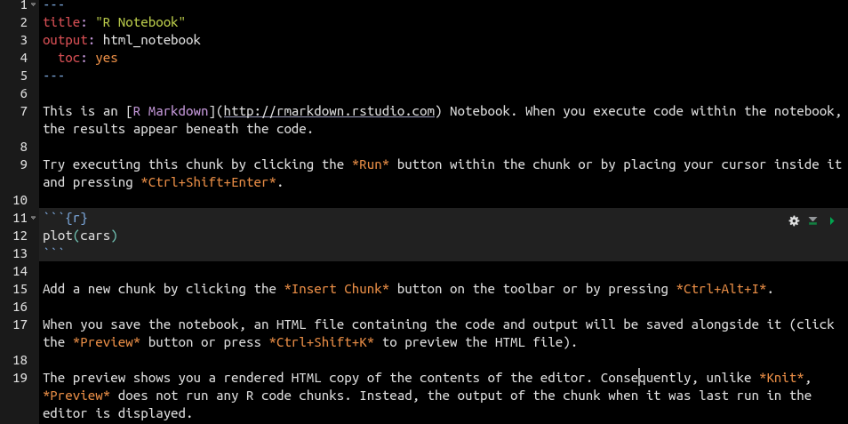

---

<a rel="license" href="http://creativecommons.org/licenses/by/4.0/"></a>

This tutorial is licensed under a <a rel="license" href="http://creativecommons.org/licenses/by/4.0/">Creative Commons Attribution 4.0 International License</a>. 

*Share, adapt, and attribute please!*

---

# The working directory
Every time you open a new session in R, it assigns a *working directory* on your local computer. This is the folder where R looks first to search for a file from your computer, or save an R object. By default, this should be your home directory but it's always crucial to know where it is. To see the current directory at any point in a session use the `getwd()` function.
```{r}
getwd()
```
Rather than typing a long path from your home directory to the desired folder where you export and import files from and to for each project, it is wise to set a new specific working directory at the beginning of each script with the `setwd()` function. **Warning**: you'll see later that some people discourage you from doing this!

To find the path to your folder, you can open the desired folder on your computer, right click on an empty space in the folder and select `Properties`. The path to the folder from your home directory should be indicated there. Sequential folders in the path in R are separated by a `/`. Windows users, be careful! The default in windows is a `\`, so you have to change all of them to a `/`.

A Windows user's path should be something like: `setwd("C:/Users/username/folder/folder/folder")`.
A Mac user's path should be something like: `setwd("/Users/username/folder/folder/folder")`.
A Linux user's path should be something like `setwd("/home/username/folder/folder/folder")`.

If you're using someone else's computer and you don't know how to set the path, you can always use `getwd()` at the beginning of a session to see how the path is formulated.

R also cannot set the working directory to a folder that does not exist. So make sure to pick an existing folder or create one before hand.

---

**TIP**: you can let R search for a folder and create one too if it does not exist.
```{r, eval = FALSE}
# mainDir is the path to your main directory and subDir should be a character in "" with the new folder name. Example:
# mainDir <- "/home/masumi/EcoLac/"
# subDir <- "Data"
dir.create(file.path(mainDir, subDir)) # this will create a warning if the folder already exists
# this sets the working directory to the new folder inside the old working directory mainDir
setwd(file.path(mainDir, subDir))
```

---

# R Projects
Now, I mentioned that some people discourage you from beginning scripts with `setwd()`([see here](https://www.tidyverse.org/articles/2017/12/workflow-vs-script/)). Why? Because this is probably the most crucial step to make any script work, but it fails **every** time when you share scripts with someone. The phylosophy is, if you share a script with someone, it should be working without frustration.

A useful tool to avoid this problem is to work with **R Projects**. What does a R Project do? It's quite simple. Creating a R Project creates a new folder with a name that you give it and it creates a `.Rproj` file inside. Alternatively, you can navigate to an existing folder and name the project the same as the folder. Then R will not create a new folder but only puts a `.Rproj` file inside. Opening a R Project will open a new R session that indicates on the top most right corner that you are in a specific project (e.g.: ). By opening a R Project, you will never have to set the working directory. The working directory is set automatically to the folder where the `.Rproj` file is located. This will be your main directory. Now this is great. You do not have to worry about the working directory anymore. You can write your script and your paths for saving files with the top-level folder being the folder where the `.Rproj` is located.

Not convinced yet? This probably becomes more obvious if you work on several projects at the same time. Usually, R can only open one session and you can open several scripts in it. However, with projects a session is attributed to each project, so you can have several R Studio windows open to not confuse them.

Then, the most powerful tool is probably working with collaborators. I personally haven't had the experience with this, but I can easily imagine how useful this can become. With several collaborators working on a paper, it doesn't matter whether you are physically close or remote, you will need to share data and codes. With R projects, you simple have to send the whole folder including `.Rproj` and your collaborator can immediately run your scripts without initial hassle of setting up your configuration of folders to make it work.

Now, for sharing you will have to start a way to organise your data in the project folder. I will explain this in the next paragraphs. Let us first, create a project:

## Create
To create a R Project, you'll have to navigate to the upper left corner in R Studio. You'll find a .

It will open a window like this:
<center>

</center>

---

So you have the option of

1. Creating a new folder with a `.Rproj` file
2. Choose an existing folder with data and code and putting a `.Rproj` file in it
3. Cloning a project from an online repository

Number 3 is useful in case you are using packages that work in a different version of R because it hasn't been updated by the creators for example. But this is less important in our case.

---

If you open a R Project, the following actions are taken:

* A new R session (window) starts
* The `.Rprofile` file in the main directory is sourced
* The `.RData` file in the main directory is loaded
* The `.Rhistory` file in the main directory is loaded (so you can use the console up/down arrow command to view your code history)
* The current directory is set to the project's main directory
* Other RStudio settings, including which scripts were open are restored, so it will look exactly the same as when you closed the project the last time.

This is the default set-up for R Projects. You can always change this through `Tools > Project Options ...`.

---

However, reproducible research practices recommend you to **not** save the `.RData` file. Why? The `.RData` file stores the objects that you have created during a session. Now if you share your script with someone, and you did not notice that the script works on an object that you have created in another script, but you didn't share your whole folder... Do you see how this becomes problematic?

Additionally, do not change anything in your `.Rprofile` file. In this file you could specify certain conditions that you'd like R to run by default. The same problem applies here, if you have set certain settings only for your R sessions (e.g. loading certain packages by default), other people will have a hard time running your script. Not only other people, imagine you would change the `.Rprofile` file for each project. It will be hard to keep an overview of which settings you've set yourself.

Furthermore, your daily habit should be:

* Restart R or your R project often and re-run your under-development script from the top (`Ctrl` + `a` and `Ctrl` + `Enter`).
* Do not save `.RData`

---

If you have R objects that take a lot of time or computing power to create, you can always save the object on your local computer and load it again.

```{r, eval = FALSE}
saveRDS(object_name, ("Objects/object_name.rds")) # to save
object_name <- readRDS("Objects/object_name.rds") # to load
```

It makes sense anyway, to split your scripts into logical steps rather than creating a single script with thousand lines.

---

## Folder configuration
Ideally, the project folder is named after an experiment or your potential paper and has all the raw files, summary tables, scripts and figures inside.

Does this look familiar?

<center>


Source: https://atrl.net/forums/
</center>


---

Well, if you can find your data and necessary documents without having to think longer, I'll not say anything. But yes, in my opinion, tidying is important. For sharing, but also for saving yourself time clicking through all your folders and not accidentally loosing data (!).

---

I recommend everyone to have a tidy folder system for each project. I guess everyone has their own way of configuring folders but I'll just give you my example and you can re-use, adapt or create your own.

<center>

</center>

---

So ideally, this is your main directory with your `.Rproj` file. You'll have separate folders for figures that you create, functions that you might have written yourself and are using in the scripts. The scripts are separately located in your 'Scripts' folder (name your scripts "1_StepName.R", "2_StepName.R" and so on if you have a sequence of scripts to run your analysis). Then a folder with manuals for specific packages that you use. And an 'Objects' folder for R objects that you might want to save during your workflow to link scripts.

Now, the 'Data' folder is one of the most important. Here, you will locate all the raw files that you need for each project. This is important. We will learn later how to automatise raw data extraction from instrument files. Why? It comes back to reproducibility again. In my opinion, many mistakes happen when you create summary excel files by simple copy and pasting. This way, you can avoid this major human error that *anyone* makes.

<center>

</center>

---

So you have the 'Raw' folder that should contain all your raw files. To make the overview easier, I recommend to have separated folders for different variables. Just to give an example:
<center>

</center>

And as you can see in the earlier picture, you'll have summary files that are outputs of processing all your raw files per variable and finally, a master file that combines everything.

---

Whether you keep a tidy folder configuration is your choice. But, it probably takes 1 minute to set this up and I'm sure it will save you quite some frustration in the long-term.

---

Going back to the advantages of R Projects:

If you have a file configuration like this, it will be easy for you to set up the paths to read and save your files.

Just to give an example. Let's say, you'd like to read in a table that you created from your raw files.

Your path would be simply:
```{r, eval = FALSE}
sum1 <- read.csv("./Data/Summary/summary_table1.csv")
```
*Note*: `csv` stands for "comma separated values". This will be the file format you'll be using mostly when working in R.

---

Or saving a plot:
```{r, eval = FALSE}
ggsave("./Figures/plot_name.png", plot = plot_object)
```

These functions are just examples, I'll explain them to you later. I just want you to see the simplicity of the path, no long path names from your home directory. And anyone that receives your R Project with these folders will not have a problem running your script.

---

If you'd like to read more about R Projects, find RStudio's more detailed introduction to it [here](https://support.rstudio.com/hc/en-us/articles/200526207-Using-Projects).

---

# Keeping track and reporting your analyses

One thing I have noticed during my master's is that I had a hard time following my work on my computer. May it be creating new summary tables, statistical analyses or making new plots. For example, I ended up filling my 'Figures' folder with numerous figures of which I did not know any more, which one was the final version. Some of you might save the plots with a version extension (e.g. "plotname_v1", ..., "plotname_vfinal"), which I probably should have done. Instead, I ended up re-running my whole analyses from the beginning and saving the final plots in a 'Final_figures' folder. It didn't take me long, thanks to R and daily habits of keeping clean (more or less) independently working scripts. But it was probably one day that I could've saved if I had a better system for tracking my research progress.

---

As I started my PhD, I found a new side of R: *R Markdowns* and *Notebooks*.

## R Markdowns
*R Markdowns* are text files with *chunks* of codes, which R executes. Basically, any text outside of a *chunk* is just a plain text and cannot be seen by R.

It may sound difficult to grasp at first, so let's create one.

### Create
Go to the new file button on the top left in R Studio  and select "R Markdown ...".

This window will appear:
<center>


</center>

---

You can either give it a title or leave it. The title can be changed any time. And the title is not automatically the name of the file. Then, you can select what kind of document it should be saved as. Recommended is HTML, as you can always switch to a PDF or Word document afterwards.

Once created, you'll have a document like this, together in the upper bar on top of your text editor, where all your other scripts are open in RStudio:
<center>

</center>

---

#### YAML Header
The first lines are surrounded by blue `---` and represent the 'YAML' header. For those interested, 'YAML' stands for 'Yet Another Markup Language'. This is where you specify the title of the document, author, date and what kind of document should be produced. In this case it's a html file. Here, you can also set font size, font style etc. All of these options for HTMLs can be found [here](https://bookdown.org/yihui/rmarkdown/html-document.html).

The R Markdown is saved as a `.Rmd` file and the HTML file is saved separately with the same name in the same directory. HTML files are easily opened by any browser application of your choice.
The working directory of a R Markdown is by default set to the folder where your R markdown is saved in. Be aware of that! If you open a R Markdown in a R project, the main directory of the Markdown wins over the R project main directory.

---

#### Code chunks
After the YAML, the default example starts with a *chunk*. A chunk is indicated by a shady grey area that starts with triple back points and `{ }`  brackets and end with triple back points again.
Each chunk can be written in any language that you like. Here, we have a chunk that is executed by R (indicated by `r`), but also other languages such as python, sql, bash can be run in a chunk, too. If you want to run a code inside a *chunk* either press the  to execute only the current chunk or all chunks above with the  button, or navigate your cursor inside a chunk and press `Ctrl`+ `Shift` + `Enter`. R will only read and execute the code inside the chunk.

To create a new chunk press `Ctrl` + `Shift` + `I`.

---

#### Text
The *chunk* is surrounded by a narrative text that is not a code. If you know how to write HTML documents, I think this will be very easy. All HTML commands work outside a chunk. But you actually don't need to know much. 

Just to give a few examples:

* To make a text *cursive*, surround the text with one star `*cursive*`
* **Bold** texts are surrounded by two stars `**bold**`
* Lists are created by putting a `*` at the beginning of a line or by numbering them
* Embed a picture from your local directory with ``
* Attach a link with `[text to be hyphened](https://link.com)`

You can also make headers with `# Header 1`, `## Header 2`, `### Header 3`, `#### Header 4` (headers will decrease in font size from 1 > 4) and include a `toc: true` in your YAML as in the example above. 'toc' stands for table of contents and it will create a table automatically at the beginning of the document.

Additionally, there is also a spell checker that you can use  on the upper left.

---

Once you'd like to see the output of your markdown text, press the 'Knit'  button on the top left. It will produce your html document and the 'Viewer' will open the document too, so you can see it directly in R Studio.

---

**TIP**: Find more instructions on how to create R Markdowns here:

* [Book](https://bookdown.org/yihui/rmarkdown/)
* [Cheatsheet](https://www.rstudio.com/wp-content/uploads/2015/02/rmarkdown-cheatsheet.pdf)
* [Reference manual](https://www.rstudio.com/wp-content/uploads/2015/03/rmarkdown-reference.pdf)

---

Now, how can this be useful to you? Remember, I recommended you to annotate your scripts with `#`? Annotation is important and useful not only for others but also for you. However, if you're trying to make your workflow accessible to a wider audience, you might want to add more information and explanations. Describe your intentions of the code more elaboratively, so it will be easier to follow.

But, can it be useful to you directly?
I can think of this example: it is tedious to copy and paste error or warning outputs with `#` annotations in a script. Usually, people tend to find the solution to the error, fix it and move on without keeping track of the progress. What happens if you encounter that error again? Do you remember how you solved it?

With R Markdown, you can leave the code that creates an error in a chunk by setting it to `{r, error = TRUE}`. It will print the code that produces the error and the error itself in the html document. You can open and read the html document any time. You don't even need to open R for it.

Or think of reporting your supervisor what you've done in R. Many PIs nowadays expect you to know R, but on the other hand, few PIs actually do know R themselves. I remember one of my professors telling me to calculate my variables in excel again because he could not follow the R script. If you have a controlling PI like that, R Markdowns could be useful. After each chunk of code, you'll see the output below and you can thoroughly explain what you're doing.

Another potential usage is when you have to create a standard operating procedure (SOP) for your lab. May it be a SOP for a computing pipeline, analysing your raw data or any other protocol. Once you're used to HTML, it might be less frustrating than fiddling with formatting in Word documents... Well, this is probably largely affected by personal preference.

Anyhow, in my opinion, for your own usage there is a more powerful tool: *R Notebooks*.

---

## R Notebooks - your electronic (shareable) lab book
I started with explaining *R Markdowns* because *Notebooks* are essentially built the same way. Create a new R Notebook by navigating to  and selecting "R Notebook".

<center>

</center>

---

You'll have the same YAML header with this time a different output format a `html_notebook`, so it creates a `.nb.html` and a `.Rmd` file. All the other commands are the same, but the main difference to a simple markdown is that the output of a chunk is immediately visible beneath the input. You don't have to 'Knit' the document first, before seeing it.

To quote from the book ["R Markdown: The Definitive Guide"](https://bookdown.org/yihui/rmarkdown/notebook.html):

> R Notebooks [...] allow(s) for direct interaction with R while producing a reproducible document with publication-quality output.

Any R Markdown document can be used as a Notebook, and all R Notebooks can be formatted into any other markdown document type such as PDF or Word. Therefore, the interactive immediate response of Notebooks makes it in my opinion a better choice for an every day tool to use as an electronic lab book.

Here are just some examples from my recent Notebook, so you can see how it looks.

* Tables 
* Plots 
* Several plots 

---

At the moment, I am keeping one Notebook file per analysis. Actually, I just started so I have a Notebook that says `ExplorativeAnalysis.Rmd`. It keeps preliminary plots that I create while coding inside the HTML file, without saving the plots actually as a `.png` file, so it keeps my `Figures` folder tidy. 

But I can also imagine, if you code heavily every day, a day to day or week by week notebook might be more appropriate.

Working in the Notebook will not produce the HTML file immediately, similarly to 'Knit' you have the 'Preview'  button that actually creates the `nb.html` file, which will be opened in your 'Viewer' panel, too. Note here, that it will save all the outputs below your chunks including plots, tables, errors etc. that you actually see inside your text editor. So, if you did not run a chunk, there will be no output saved in the HTML.

Whether you find this useful or not is, again, your choice. I had a hard time keeping manual notes next to my computer in my "Stats lab book", because I get too focused when coding. And I'd be too tired to make notes after a full day of coding about what I had done. With this, I can do both at the same time.

However, for example, I made this workshop in R markdown rather than in a R Notebook. I think it depends on where your priority lies. If you're creating a text heavy document (e.g. tutorial) go for a R Markdown and a code heavy document choose a R Notebook: Different scenarios, different solutions.

---

# Reproducibility and sharing

So, why is all of this important? Why should you make it a daily habit to keep codes transparent, organise your research and keep track of what you're doing?

First of all, I'm sure it will make you more productive and efficient.

Besides that, science is facing a major crisis right now that is named the "reproducibility crisis". Results are not reproducible between labs or even colleagues from the same lab. It started from the field of psychology but extended fast to other fields including biology and ecology. Of course, a lot of it emerges from how we produce data but according to a [survey by Nature](https://www.nature.com/news/1-500-scientists-lift-the-lid-on-reproducibility-1.19970), researchers think that one of the main points to enhance reproducibility is a *'better understanding of statistics'*.

---

#### Know where to look and ask for help
Now, we are all biologists/ecologists by education but rarely are we statisticians/informaticians. However, we are expected to be ... basically everything. We try our best to learn and master these skills, like you are doing right now. But it is perfectly normal to not understand things, especially in early career stages. Doing your analyses in R is already a great improvement towards understanding statistics rather than clicking through a GUI like SPSS or SigmaPlot. In order to apply a code correctly and make it work, one has to do more research on statistics to understand it.

---

Nevertheless, some methods are just *hard* to understand because of their complexity. That's when the open community in recent science can be very helpful. Then, sharing transparent code with an *immediately* working example for anyone trying to help you will be the most important to get your answers. Just imagine, someone gives you a script to ask for help and it'll be non executable because he/she didn't think of all the dependencies such as loading packages, directories and links to other scripts... Your motivation to help this person will definitely vanish in seconds.

---

Some great books:

* [Discovering statistics using R](https://www.Amazon.ca/Discovering-Statistics-Using-Andy-Field/dp/1446200469)
* [Numerical ecology with R](https://www.amazon.ca/Numerical-Ecology-R-Use/dp/1441979751)
* [R Cookbook](https://www.amazon.ca/Cookbook-Recipes-Analysis-Statistics-Graphics/dp/0596809158/ref=sr_1_1?ie=UTF8&qid=1539960979&sr=8-1&keywords=R+cookbook): this a series also with a book only for graphics and handling data

---

Online and free:

* [Cookbook for R](http://www.cookbook-r.com/)
* [R for Data Science](http://r4ds.had.co.nz/)
* [R Studio Cheatsheets](https://www.rstudio.com/resources/cheatsheets/)

---

Look for help: Communities

* [Stackoverflow](https://stackoverflow.com/questions/tagged/r)
* [R-bloggers](https://www.r-bloggers.com/)
* [Research Gate](https://www.researchgate.net/)
* [R Studio Support](https://support.rstudio.com/hc/en-us)

---

Furthermore, many journals are starting to advice or even require the R scripts you've used to produce your results to be publicly available, share your raw data on a data base and make your whole workflow accessible and reproducible by anyone.

Just to name a few:

* [PLOS](https://journals.plos.org/plosone/s/data-availability)
* [AGU](https://publications.agu.org/author-resource-center/publication-policies/data-policy/)
* [Nature](https://www.nature.com/sdata/policies/repositories)
* [Elsevier journals](https://www.elsevier.com/authors/author-services/research-data)

So if you consider publishing in such a journal, you better know how.

---

#### Some science phylosophy...
In my opinion, recent movements towards transparency, sharing and collaboration will only serve us well. I deeply hope it will also shift the science community away from competitiveness towards a more common collective effort. That's what science was about before the 'publish or perish' era, right? A curiosity driven passion that would advance the collective knowledge of human kind rather than individual success. It might appear like a lot of work, but all of these things will also help you to keep an overview of your own research.

---

#### Some last comments on reproducible workflows
It is also good to include information on what kind of computer, which version of R you were working in when you did your analysis.

You can get this easily with. Best is to include it in the beginning of each R markdown that you create:
```{r}
sessionInfo()
```

Then, for statistics that include iterations that are random, you can reproduce your random numbers with
```{r, eval = F}
set.seed()
```

this can be shared, so that another person running the same analysis ends up with the same results.

---
