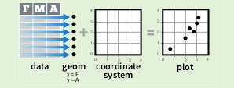
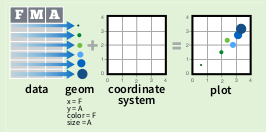
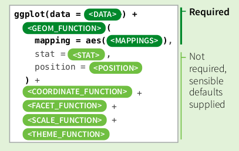
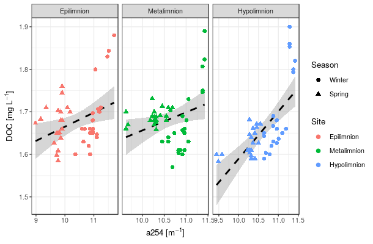
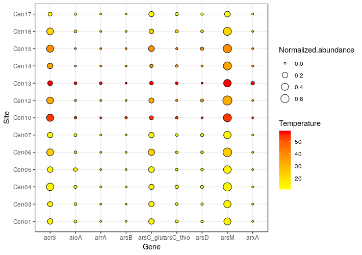

```{r setup, include=FALSE}
knitr::opts_chunk$set(echo = TRUE)
```

Ploting is a vital part of research. There are several ways of plotting in R.
Plotting with the `base` package is popular with the 'traditional' R users, but personally, I prefer plotting with `ggplot2` because of it's intuitive coding of plotting and makes life easier for people working with categories and colouring.

---

Let me first introduce you to some basic plotting with the built-in data set `iris`:

# Base plotting
```{r}
# Plotting a continuous and a categorical variable creates a boxplot by default
plot(iris$Species, iris$Sepal.Width)

# Plotting two numerical variables
plot(iris$Sepal.Length, iris$Petal.Length)
```
```{r}
# Adding a line from a linear model
iris.model <-lm(iris$Petal.Length ~ iris$Sepal.Length) # don't forget formulas are: y ~ x
plot(iris$Sepal.Length, iris$Petal.Length)
abline(iris.model, col = "red")

# Adding title and changing axis names
plot(iris$Sepal.Length, iris$Petal.Length, xlab = "Sepal Length", ylab = "Petal Length")
abline(iris.model, col = "red")
title(main = "A simple graph")
```

You can see that plotting is sequential. You can add layers such as the line onto the plot by executing them together with the `plot()` function. Either mark them all together with your cursor and execute, or execute them sequentially starting with the `plot()` line.

For me, anything more complex than this becomes tedious in `base` plotting. Especially, for colouring, I'm not particularly happy. Some of you might think otherwise, but I learnt both at the beginning of learning R and I decided to get good at `ggplot2`. I would advice you: pick one and stick to it, most plots can be created in both ways.

You can find instructions how to use `base` plotting [here](https://www.harding.edu/fmccown/r/) and some advanced `base` plotting [here](https://www.cyclismo.org/tutorial/R/intermediatePlotting.html).

I will focus on `ggplot2` today.

---

# *ggplot2*
`ggplot2` is also part of the package `tidyverse` that we have installed before. In case you haven't loaded `tidyverse` or `ggplot2`, let's do that.
```{r}
library("ggplot2")
```

## The grammar of graphics
`ggplot2` has a different way of constructing your plot. `ggplot2` is based on the grammar of graphics, the idea that you can build the same graph with a small set of the same components:

* a data set
* a coordinate system
* `geoms` (geometries), visual remarks that represent data points

<center>

</center>
<br>

Let me illustrate:
```{r}
ggplot(iris)
```

We have given `ggplot` the dataset, but we did not specify any aesthetics using `aes()`.

We will try to re-create the `base` plot, so we specify the x and y-axis.
```{r}
ggplot(iris, aes(x = Sepal.Length, y = Petal.Length))
```

So what happened here? We gave `ggplot` the data and the coordinates (x and y-axes), but we actually did not tell it how to visualise the data.

---

### Geometric layers

This can be done by using geometric layers. They are added to the base `ggplot` function with a `+` and have the `geom_` prefix.

```{r}
ggplot(iris, aes(x = Sepal.Length, y = Petal.Length)) +
  geom_point()
```

---

Let's re-create the boxplot plot we had before.
```{r}
ggplot(iris, aes(x = Species, y = Sepal.Width)) + 
  geom_boxplot()
```

---

**Advanced tip**: Note here, that this boxplot looks a bit different than the `base` boxplot. Can you spot the difference?

You'll see that we have more values visualised as 'outliers' here than before. This is simple, `ggplot` has different defintions of quartiles and what values are considered to be outliers. You can check how `ggplot` creates these boxplots by `?geom_boxplot` section 'Computed variables'.

If you're not happy with how `ggplot` computes whiskers or anything else, this can be changed by your own computations using the `stat =` argument and specifying each aesthetic as given in the help file example:
```{r, eval = FALSE}
# It's possible to draw a boxplot with your own computations if you
# use stat = "identity":
y <- rnorm(100)
df <- data.frame(
  x = 1,
  y0 = min(y),
  y25 = quantile(y, 0.25),
  y50 = median(y),
  y75 = quantile(y, 0.75),
  y100 = max(y)
)
ggplot(df, aes(x)) +
  geom_boxplot(
   aes(ymin = y0, lower = y25, middle = y50, upper = y75, ymax = y100),
   stat = "identity"
 )

```

---

So, geometries can be combined as desired. What if you'd like to see the variation of your variables on your boxplot? This is easily done with the `geom_jitter()` function.

```{r}
ggplot(iris, aes(x = Species, y = Sepal.Width)) + 
  geom_boxplot() +
  geom_jitter(colour = "red")
```

Note in this example, that you have `aesthetics` in your base `ggplot()` and you could assign separate aesthetics to your geometries such as `geom_boxplot()`. Aesthetics specified in your base function will be implemented in all other layers that you add to `ggplot`. On the other hand, aesthetics specific to your `geom_` function are only valid for one geometry layer.

---

### Aesthetic layers

Besides x and y coordinates, `aesthetics` include also the size, shape and colour of a geometry. In case you'd like to assign a colour that is *not based on data* as in the jitter example above, the `aes()` function is not needed.

<center>

</center>
<br>

---

However, if you'd like to visualise the colour *based on data* by ... let's say 'Species' in the earlier continuous plot, you'll have to use `aes()`.

```{r}
ggplot(iris, aes(x = Sepal.Length, y = Petal.Length)) +
  geom_point(aes(colour = Species))
```

---

To illustrate other options of `ggplot2`, let's use a new data set `lake_incubation.csv`.

This is a data set is a tiny subset of my Master thesis. I conducted biodegradation experiments in a lake (Lake Lunz, Austria), where I sampled the inlet, outlet, epilimnion, metalimnion and hypolimnion once a season for a year. We filtered the water by 0.7 µm and incubated bottles in triplicates over a period of 20 days to monitor how microorganisms degrade dissolved organic matter and how the quality of it changes. I only included the following measures for this excercise:

* `DOC` is a quantitative measure of dissolved organic carbon
* `a254` is the absorption coefficient at 254 nm measured by a spectrophotometer, indicative of coloured DOC concentration
* `a440` is the absorption coefficient at 440 nm also measured by a spectrophotometer, indicative of the water colour

This is just a subset, so we only have the stratification layers of the seasons Winter and Spring (sorry the data is in preparation for a manuscript!).

```{r}
lake <- read.csv("./Data/lake_incubation.csv", sep = ";", dec = ".", stringsAsFactors = F)
head(lake)
```

---

Let's plot dissolved organic carbon and the absoprtion coefficient a254, commonly used as a indicator for DOC concentration.

```{r}
ggplot(lake, aes(x = DOC, y = a254)) +
  geom_point(aes(colour = site, shape = season))
```

You'll see a legend for each aesthetic that you have specified. Now, the sequence of categories that appear in the legend are usually alphabetical and sometimes it makes sense to have a more intuitive sequence of categories. To do this, we make use of *factors* and give our categories levels:

```{r}
lake$season <- factor(lake$season,levels=c("Winter","Spring"))
lake$site <- factor(lake$site,levels=c("Epi", "Meta", "Hypo"))

ggplot(lake, aes(x = DOC, y = a254)) +
  geom_point(aes(colour = site, shape = season))
```

---

Now, in case you are not happy with the shapes and colours that are used by default, you can easily change this with `scale_` functions:

Depending of what kind of variable and what type of aesthetic you are changing, the `scale_` function differs. Just start typing `scale` and push `Tab` and your options will appear.

In our case we are using categorical variables for colour, so we use `scale_color_manual()`. To see what kind of arguments can be specified, you can use the `Tab` completion again inside the function:

```{r}
ggplot(lake, aes(x = DOC, y = a254)) +
  geom_point(aes(colour = site, shape = season)) +
  scale_colour_manual(values = c("skyblue","royalblue","navy"),
                      name = "Site", breaks = c("Epi", "Meta", "Hypo"),
                      labels = c("Epilim", "Metalim", "Hypolim"))
```

You can see that we also have changed the legend title and how the sites are displayed in the legend. Not that the filling of `breaks =` has to be exactly the same as they are in your data set, otherwise R cannot find the categories.

---

Now, maybe it might be more intuitive to set the colour by season and give the sites shapes. However, I want you to be careful when using colours. Be always aware of the fact that many plots are shown during a presentation and thus can be hard to see on a projector (e.g. yellow, light-green etc.). Furthermore, there are quite some colourblind people in this world. `ggplot2`'s default colours are usually accounting for colourblindness, but if you start explloring colours, you should always keep this in mind. I found a colourblind palette online that I often re-use:

```{r}
cbPalette <- c("#999999", "#E69F00", "#56B4E9", "#009E73", "#F0E442", "#0072B2", "#D55E00", "#CC79A7")
```

But if you still want to see the options of colours in R, use this function:
```{r, eval = FALSE}
demo(colors)
```
By pressing `Enter` in your console, you can navigate through several plots. Some of them contain the colours and the colour names that you can specify in the `values = ` argument.

---

Here is an example on how to set the colours and shapes manually:

```{r}
ggplot(lake, aes(x = DOC, y = a254)) +
  geom_point(aes(colour = season, shape = site)) +
  scale_shape_manual(values = c(25, 23, 24),
                      name = "Site", breaks = c("Epi", "Meta", "Hypo"),
                      labels = c("Epilim", "Metalim", "Hypolim")) +
  scale_color_manual(values = c(cbPalette[6],cbPalette[4]),
                     name = "Season", breaks = c("Winter","Spring"))
```

Note that the sequence of variables used when giving colours and shapes, will depend on what you have specified in the `factor(levels = c(pos1, pos2, pos3))`.

---

One special aspect of `ggplot2` is that you have two options to colour the geometries. `fill = ` and `colour = `. `Colour` are usually the edges and `fill` is the colour inside. For some geometries, it's the same, but in case of points, you could specify them separately:


```{r}
ggplot(lake, aes(x = DOC, y = a254)) +
  geom_point(aes(fill = season, shape = site), colour = "black") +
  scale_shape_manual(values = c(25, 23, 24),
                      name = "Site", breaks = c("Epi", "Meta", "Hypo"),
                      labels = c("Epilim", "Metalim", "Hypolim")) +
  scale_fill_manual(values = c(cbPalette[6],cbPalette[4]),
                     name = "Season", breaks = c("Winter","Spring"))
```

Be careful when you switch between colour and fill, you'll have to change the `scale_` function, too!

---

### Coordinate layers

These are functions that impact the *coordinates* of a plot such as flipping x and y coordinates:
```{r}
lake$site <- factor(lake$site,levels=c("Hypo","Meta","Epi"))

ggplot(lake, aes(x = site, y = DOC)) +
  geom_boxplot() +
  coord_flip()
```

---

### Facet layers
As ecologists, we often work with several categories at a time. In such cases, facetting becomes very useful. Faceting will separate your plot into multiple panels by category.

```{r}
ggplot(lake, aes(x = timepoint, y = DOC)) +
  geom_point() +
  facet_grid(season~site) # y ~ x
```

This would also work with only one facetting category. Either by column `~ cat1` or by row `cat2 ~`. And in case you have very different scales depending on your categories, you can also set `scales = "free_x"` or `scales = "free_y"`.

---

### Theme layers
With an additional line of code, you can easily change how the plots look. There are default `themes` that you can use, or you can also create your own theme. If you're only interested in changing some parts of the appearance, you can do this with the `theme()` function, too.

```{r}
ggplot(lake, aes(x = l.site, y = DOC)) +
  geom_boxplot() +
  theme(axis.text.x = element_text(angle = 45, hjust = 1, vjust = 1))
```

```{r}
ggplot(lake, aes(x = l.site, y = DOC)) +
  theme_bw() +
  geom_boxplot()
```

---

Explore even more `themes` by installing and loading `ggthemes`.

---

#### Create your own theme
One thing you'll realise is that you'll end up ending a lot of detail of ggplot's appearance. To keep code nice and tidy, you can create your own theme, save it and re-use it every time, you create a new plot.

To find out how to write a theme layer, call an example (without `()`):
```{r}
theme_bw
```

You'll see all the different arguments, and what has been changed for this particular theme. Either, you can create a theme from scratch by changing all arguments. However, if you already identified a theme that you like, you can add changes to the theme:

```{r, eval = FALSE}
theme_custom <- function () { 
    theme_bw(base_size=12, base_family="Avenir") %+replace% 
        theme(
            # change stuff here
        )
}
```

Here is a specific example:

```{r, eval = FALSE}
theme_custom <- function () { 
    theme_bw(base_size=12, base_family="Avenir") %+replace% 
        theme(
            panel.background  = element_blank(),
            plot.background = element_rect(fill="gray96", colour=NA), 
            legend.background = element_rect(fill="transparent", colour=NA),
            legend.key = element_rect(fill="transparent", colour=NA)
        )
}
```

Then, you can save this object and save it as an R script, in your `./Functions/` folder as `theme_custom.R` for example.
For each new script, you only have to call that R script with `source()` and your custom theme is usable as all other themes.

```{r, eval = FALSE}
source("./Functions/theme_custom.R") # immediately usable as:

ggplot() +
  theme_custom() +
  geom_point()
```

---

### Labelling
As we often avoid spaces in R by using `_` or `.`, this is not particularly beautiful for final plots. We can easily change labels with `lab` functions:

```{r}
ggplot(lake, aes(x = l.site, y = DOC)) +
  geom_boxplot() +
  geom_jitter(aes(colour = season)) +
  labs(y = "DOC", x = "Site", colour = "Season")
```

---

Adding units to labels is vital, too. A bit more difficult but not overly complicated:

```{r}
ggplot(lake, aes(x = l.site, y = DOC)) +
  geom_boxplot() +
  geom_jitter(aes(colour = season)) +
  labs(y = expression(paste("DOC [mg L"^-1,"]")), x = "Site", colour = "Season")
```

Here we use the `expression()` function that is usually used to express mathematical symbols (e.g. alpha, beta, gamma, etc.). Here, `^` means superscript and `[]` are subscripts. You have to separate them from the actual text that are in quotes, that's why we use the `paste()` function to combine them together.

So, in case you'd have for example oxygen you'd use:

```{r, eval = F}
labs(y = expression(paste("O"[2], " [µg L"^-1,"]")))
```

Numbers do not have to be surrounded by quotes.

---

In summary, there are parts of the `ggplot()` function that are necessary and others are optional, use this template taken from the `ggplot2` cheatsheet:

<center>

</center>
<br>

Just keep in mind that the last layer added to the `ggplot()` function cannot end with a `+`. R will wait for you to put another layer without plotting anything.

---

##  Saving plots

Saving plots with `ggplot2` is very easy, first we have to save the plot as an object:

```{r}
boxplot <- ggplot(lake, aes(x = l.site, y = DOC)) +
  geom_boxplot() +
  geom_jitter(aes(colour = season)) +
  labs(y = expression(paste("DOC [mg L"^-1,"]")), x = "Site", colour = "Season")
```

**Tip**: Remember here, that saving a plot as an object will not print the plot when executing the code. Simplify this by surrounding your piece of code with `()`. This will save it as a object and print the plot at the same time.

---

For actually saving the plot on your local computer use the `ggsave()` function.

```{r, eval = FALSE}
ggsave(boxplot, "./Figures/boxplot.png", units = "cm", width = 3, height = 5)
```

Here, you can specify the place were the plot is supposed to be saved and it's size (in the unit that you specify). Important is, it will save the plot with the indicated extension. If you want a image file use `.jpg` or any other preferred extension.

---

## Resources

Use the [ggplot cheatsheet](https://www.rstudio.com/wp-content/uploads/2016/11/ggplot2-cheatsheet-2.1.pdf) to expand your usage. This sheet is gold, it's basically my `ggplot` teacher.

Or use this quick reference [here](http://r-statistics.co/ggplot2-cheatsheet.html).

If you have more specific questions, ask google or the user community by adding `ggplot` into your question.

---

# Challenge #3:

1. Recreate this plot (this graph uses the data set `lake`):



---

2. For this excercise we use a new data set provided by the [EDAMAME workshop](https://github.com/edamame-course/2018-Tutorials/blob/master/data_visualization/data_visualization_tutorial.md) I have attended this year. I think this data set is better to explore the options of ggplot. The data set contains different genes and relative abundances of microorganisms.

```{r, message= FALSE}
library(tidyverse)
# read in data file
data <- read_delim("./Data/gene_abundance_centralia.txt", delim = "\t")

# read in meta data
meta <- read_delim("./Data/Centralia_temperature.txt", delim = "\t")

#annotate data (join data and metadata)
data.annotated <- data %>%
  left_join(meta, by = "Site")

head(data.annotated)
```

Then, recreate this plot (this plot uses the data `data.annotated`):



---


<br><br>
<br><br>
<br><br>
<br><br>
<br><br>
<br><br>
<br><br>
<br><br>
<br><br>
<br><br>
<br><br>
<br><br>
<br><br>
<br><br>
<br><br>
<br><br>
<br><br>
<br><br>
<br><br>


---

## Possible solutions
1.
```{r, eval = F}
lake$season <- factor(lake$season,levels=c("Winter","Spring"))
lake$l.site <- factor(lake$l.site,levels=c("Epilimnion", "Metalimnion", "Hypolimnion"))

ggplot(lake, aes(x = a254, y = DOC)) +
  geom_smooth(method = "lm", linetype = "dashed", colour = "black") +
  geom_point(size = 2, aes(shape = season, colour = l.site)) +
  facet_wrap(~l.site, scales = "free_x") +
  theme_bw(base_size = 10) +
  labs(x = expression(paste("a254 [m"^-1,"]")), y = expression(paste("DOC [mg L"^-1,"]"))) +
  guides(shape = guide_legend(title = "Season"), colour = guide_legend(title = "Site"))
```

2.
```{r, eval = FALSE}
ggplot(data.annotated, aes(x = Site, y = Gene)) +
  geom_point(aes(size = Normalized.abundance, fill = Temperature), colour = "black", shape = 21) +
  scale_fill_continuous(low = "yellow", high = "red") +
  theme_bw() +
  coord_flip()
```

