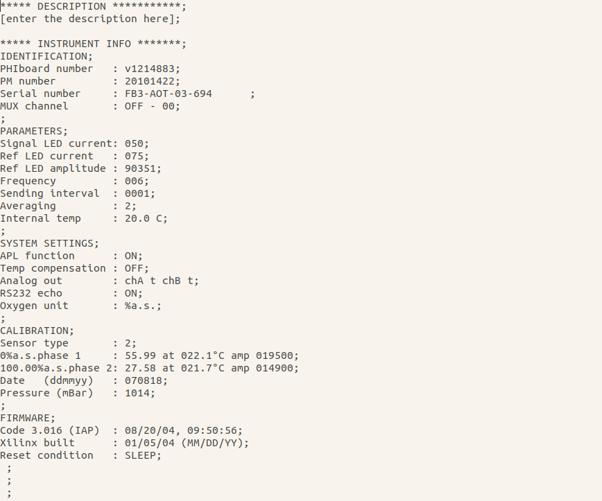
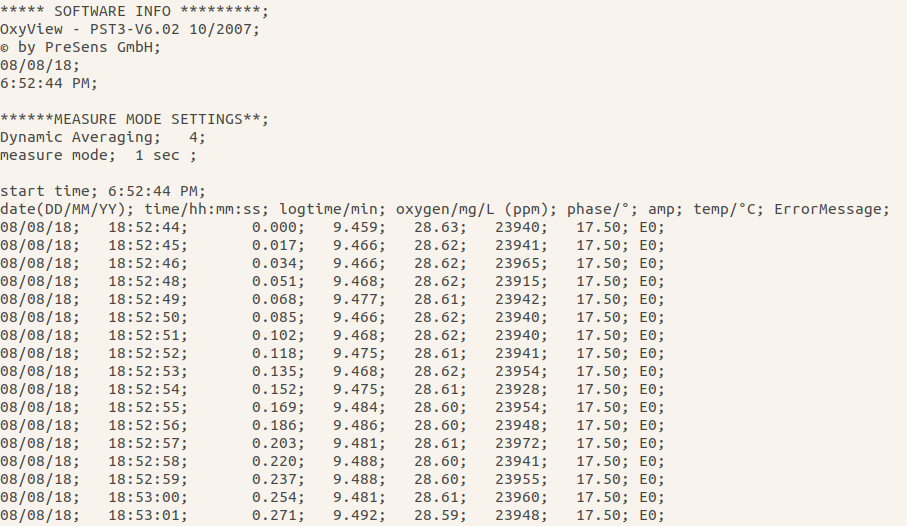

```{r setup, include=FALSE}
knitr::opts_chunk$set(echo = TRUE)
```
Now the main idea of this workshop is to teach you how to automatise raw data extraction into R but all the previous sections build up to this. You'll need to know how to organise your files, how to transform your data and plot them for this excercise.

Your raw data is, raw data. **Do not touch it!** It has to remain untouched forever.

# Inspect your raw data file
This is probably the most vital step of raw data extraction. Different instruments give different kind of outputs. Is it a text, csv or (worst case...) excel file. If your instrument is ancient and only prints the results on paper, I'm sorry there is nothing I can do for you. But usually, for any other format, there is a solution.

In case it's a text or csv file, inspect the data file. Here is an example from the Fibox3, that measures oxygen. Results are saved as a text file:

<center>


</center>

Do you remember the `read.csv()` function? In case it's a text file, you'll only have to use the `read.table()` function.

What you'll need to know to read in your text file successfully:

* How many rows until your data have to be skipped?
* What are the separators between your values?

I haven't found an easier solution of getting how many rows to skip than the old fashioned way of counting. In this case, you'd count 58 rows that include calibration values etc. until your raw data. And the separator inside your raw data is a semi-colon.

```{r}
file <- read.table(file = "./Data/Respiration/RO1-77/TR/A/T0.txt", skip = 58, sep=";", stringsAsFactors = F)
```

Now that we have successfully loaded an example text file of your instrument into R, we'll go on to the automatisation of this.

# How are your data organised?
First, it is most important to make a unified organisation of your text files. In the best case scenario, where you create the R script in advance of all your measurement, you could make a folder configuration that is most intuitive to you.

Today, we will work with my data collected for respiration incubations. We have two treatments, unfiltered and filtered water, where unfiltered water represents "Total Respiration" (TR) and the filtered water "Bacterial Respiration" (BR). For each treatment, we have replicates A and B.

To make things faster while doing the measurements, I will have a folder per sample with this treatment + replicate folder configuration, so I only name the text files by timepoint (e.g. T0.txt, T1.txt ...). This avoids retyping all of these treament and replicate names in the file name (e.g. SampleName_TR_A_T0.txt).

Why is such kind of a folder configuration important?
We will use loops to extract the data and load into R and for loops, we will need to configure in which sequence the paths to your local computer are going to be loaded.

## Loops
Loops are "expressions that allow the repetitive execution of code". This means in reality that a loop is a piece of code instructing R to repeat a set of operations a pre-determined number of times. There are 'for' and 'while' loops. Today, we will only cover 'for' loops.

To invoke a 'for' loop we need to define the number of cycles it will undertake and specify the operations to perform during each cycle:

```{r}
x <- 1 # create a starting vector

for(i in 1:100){
  x <- x + 1 # in each cycle, add 1 to x and assign it to x
}

x # print result
```

A 'for' loop is invoked using the `for()`function. In the brackets, **i** is an index that increases by 1 after a cycle is completed (Note: **i** can be anything, e.g. "index", "a","b", or even "whatever"). It does not have a function here, but we will see the purpose of it in an example later. **in 1:100** means 'step through every number between 1 and 100' - in other words do 100 cycles. Finally, the operations performed during each cycle are written within `{ }`. Therefore, the code above starts with `x = 1` then performs a loop of 100 cycles each time adding 1 to x. After 100 iterations we have the result of `x = x + 1` = 101.

The for loop before is not a particularly good example to show the sequentiality of loops, so here is another one to illustrate:

```{r}
for(year in 2010:2018){
  print(paste("The year is", year))
}
```

The best way to understand what is going on in the for loop, is by reading it as follows:

“For each year that is in the sequence 2010:2018 (short for:  c(2010,2011,2012,2013,2014,2015,2016,2017,2018)) you execute the code chunk print(paste("The year is", year))”. Once the for loop has executed the code chunk for every year in the vector, the loop stops and goes to the first instruction after the loop block.

Note that if you run

```{r}
for(year in 2010:2018){
  paste("The year is", year)
}
```

There is no output produced. Why?

The output inside a loop does not directly communicate with our *console*. Think of the *loop environment* as a separate space, you will need to use a function such as `print()` to make the output visible in your *console*.

Additionally, if you want to store the loop output in a data frame, the data frame has to exist in the *global environment* before being fed to the loop.

---

One of the most important things in a loop is to tell it, when to stop the iteration. Make use of the `length()` function for vectors or `nrow()` function for data frames.

Let's re-use the `lake` data set:

```{r}
lake <- read.csv("./Data/lake_incubation.csv", sep = ";", dec = ".", stringsAsFactors = F)
head(lake)
```

```{r}
for(i in 1:nrow(lake)){
  lake[i,"Loop"] <- lake$DOC[i] - lake$DOC[i+1]
}
```
This is where the `i` becomes important. `i` is the index we've talked about before. Inside the loop, `i` will be replaced by a number in case of `1:length(object)`. We use `i` as if it is a number in the code inside the loop. `i` will jump to the next number with each cycle that has been completed.

The above example is a loop to find out what the difference between a value and it's next row are.
You are specifying which row to fill in the "Loop" column with `lake[i,"Loop"]`. Then you are telling it to iterate through each row and subtract the DOC value of the next row from it `lake$DOC[i] - lake$DOC[i+1]`. So, `i` is always a number that changes with each cycle. Make sure to name this index value with something you haven't assigned to an object in your *environment* before.

This can become quite powerful, especially for reading in your data, for loops will be the key to making your automatisation work.

## Loop in loops

If you have a nested folder configuration as I explained before, loop in loops will be necessary.

It's not so much different than loops, it just works with more dimensions. A for loop, immediately followed by another for loop will complete the most inner loop first.

It's indeed, hard to explain... See this example:

```{r}
seasons <- c("Winter","Spring","Summer","Autumn") # vector with 4 seasons
sites <- c("Epilimnion","Metalimnion","Hypolimnion") # vector with 3 sites

sites[2] # just to illustrate if we replace the index (e.g. 'i') by an obvious number
seasons[4]

for(i in 1:length(seasons)){ # this loop goes from 1 to 4
  for(j in 1:length(sites)){ # this loop goes from 1 to 3
    print(paste(seasons[i], sites[j]))
  }
}
```

See what happened here? First, `seasons[i]` stays with `i = 1` until the second loop finishes. The second loop starts with `sites[j]` where `j = 1` then `j = 2` then `j = 3`, with 3 being the `length(sites)`. After this is done, we go back to the first loop and `i` will jump to `i = 2`, therefore selecing "Spring" and then it loops through the second loop again. This continues until also the first loops finishes the number of iterations we specified with `length(seasons)`.

Make sure that you call the index of both loops with a different object (here `i` and `j`), otherwise loop in loops will not work.

---

# What values are you interested in?

Before coding your raw data extraction loop, think of what values you are interested in. Do you need all the values in the raw data file? Do you have to compute new variables? All of this can be incorporated into the loop.

---

In the case of our respiration, I am interested in the date, time, oxygen concentration and temperature, so these are the only columns I will extract for later computation.

```{r}
path <- paste("./Data/Respiration") # create an object with the directory path

# create vectors for loop
samples <- dir(path) # get all sample names in the respiration folder
type <- c("TR","BR")
replicate <- c("A","B")

##########################################
## Loop to extract data from text files ##
## first, loops through samples, then through types and then through replicate folders

out.file <- data.frame() # create empty data frame

for(a in 1:length(samples)){
  for(b in 1:length(type)){
    for(c in 1:length(replicate)){
      ##########################################################
      wd <- paste(path, samples[a], type[b], replicate[c], sep = "/")
      ##########################################################
      
      file.names <- dir(wd, pattern = "*.txt") # creates vector with all txt files' names in directory
      
      for(d in 1:length(file.names)){
        # Read table, skips first 58 lines
        file <- read.table(file = paste(wd,file.names[d], sep = "/"), 
                           skip = 58, sep=";", stringsAsFactors = F)

        ####################################
        # Create data frame with only the necessary columns and calculate the mean per measurement
        file <- data.frame(Date = file[1,1], Time = file[1,2],
                           Oxygen = mean(file[,4]), Temperature = file[1,7])
        
        ####################################
        # Create columns with categories
        file$ID <- paste(samples[a], type[b], replicate[c], sep = "_")
        # create an unique ID with sample name + respiration type + replicate for later analysis
        file$Sample <- samples[a]
        file$Type <- type[b]
        file$Replicate <- replicate[c]
        file$Timepoint <- substr(file.names[d], start=1, stop=2) # add timepoint
        
        ####################################
        # Rearrange dataframe
        file <- file[,c("ID","Sample","Type", "Replicate",
                        "Timepoint","Date","Time", "Oxygen","Temperature")]
        
        ####################################
        # Combine each file with the initially empty 'out.file' data frame by row
        out.file <- data.frame(rbind(out.file, file), stringsAsFactors = F)
      }
    }
  }
}
```

So, this is quite some code. Let me go through it bit by bit.

1. We create an object `path` that we will re-use in the code later to extract the sample names and read in the data.

2. Then, we create three vectors to serve as a guideline for the three loops we are using. Remember that we had a folder configuration of `SampleName > RespirationType > Replicate`? This is exactly why we need this. While we do specify `type` and `replicate` manually, we create the `samples` vector by using the function `dir()`. This gives you all the folders that are present inside the folder that you specify. Now note here, that the pure `dir()` function will list any kind of object inside this folder. Therefore, it is important that there is no other folder or object than those containing raw data inside the 'Respiration' folder. Otherwise, the loop will fail.

3. Before the loop, we create an empty data frame to store the results of the loops.

Then the looping starts:

4. We will start with the highest level in the folder configuration, which is the Sample Name by using the `samples` vector. Then we go on to `type`, the second loop, and `replicate` as the third loop. We combine these three loops to create the `wd` object, which essentially creates the path to each of our folders that actually contain the raw `.txt` files.

5. We read in all existing file names with a `.txt` suffix in each folder that we navigated to using the three loops. Here, the `pattern = "*.txt"` is the most important part. If your files are saved as csv, then use `pattern = "*.csv"`. The asterisk is needed to indicate that anything before the '.txt' is accepted.

6. Then we start the fourth and last loop that iterates through the file names (e.g. "T0.txt","T1.txt","T2.txt", ...) to read in each file with the `read.table` function. Here, we paste the `path` and the `file.names[d]` together to give the function a file to read. We skip the 58 lines that we've found to be irrelevant and indicate the separator that we have identified when we inspected the raw files.

7. The rest of the code overwrites the raw `file` object to a data frame with only a selection of the columns and rows that we need. We extract the whole column for `Date` and `Temperature`, while we only extract one value for the `Time` column, as we are only interested in a single time when the measurement was done per timepoint. And we calculate the mean of the oxygen measurements during a measurement of approximately 30 seconds.
This creates a single row per timepoint, that we categorise by ID, Sample, Type, Replicate and Timepoint. We add this to the extraction step, as it makes downstream processing and plotting easier.

8. We re-arrange the data frame starting with the ID and categories, followed by the raw measurements.

9. Finally, we add the cleaned complete row that we have created to the empty data frame we created before the looping 'out.file'. For each loop iteration, a new row will be added to this data frame. This is a crucial step. Without this, the loop will finish without saving anything in your *environment*.

---

Now, these loops are easily adjustable. If you are interested in the error of the measurement, you could add a column calculating the coefficient of variation by adding a new column `CV = sd(file[,4])/mean(file[,4])*100)` when creating the `file` data frame.

---

# Repeated and automatised plotting

Now extracting raw data is done and all good. But part of the goal of this raw data extraction script was to follow the measurements while the incubations are still running. I wanted to know how the oxygen is being consumed over time and it should help me to decide whether I should continue to incubate or whether I can stop and incubate a new sample instead.

To do this, I have to:

* plot the data, to visualise oxygen consumption
* have a measure for significance

To do this, I need to transform the `Time` column to an 'actual' time. Or a time format that R can work with, calculate how much time has passed since timepoint 'T0' and create linear regressions that tell me what the slope of the consumption is and whether it is significant or not.

And as I am a truly lazy person, I want all of this in a plot that are saved on my local computer so I even don't need to look at data inside R.

---

To give an example for a clean code, let's read in all libraries that we need at the beginning:
```{r, message = FALSE}
library("plyr")
library("dplyr")
library("reshape2")
library("ggplot2")
```

---

## Working with date and times

So let's start with the time transformation and calculation first.

Dates and Times are a bit tedious in R. Especially, if you have different PCs with different languages and Date/Time formats.

One can use the function `strptime()` to combine date and time by specifying the formula such as here:

```{r}
# combine Date and Time -> change the setting of date order depending on PC settings
# check ?strptime for formats of date-time formulas
out.file$Date <- as.character(out.file$Date)

out.file$cTime <- strptime(paste(out.file$Date, out.file$Time, sep = " "), "%d/%m/%y %H:%M:%S")
out.file$cTime <- as.POSIXct(out.file$cTime) # change date/time class for calculation
```

You can check `?strptime` to find the specifics of the formula. For example, `%y` are years without the century (e.g. '18' instead of '2018'). You'll have to look how your instrument saves date and time formats and indicate so accordingly in the `strptime()` function. Do not forget that separators such as "/" and ":" are very important to identify.

Then, we transform this to a POSIXct class (it's just a type of class with a fancy name) to make calculations possible. So we can calculate the time ellapsed since timepoint T0. We achieve this by grouping our samples by their full treatment "ID" and using the `min()` function, which takes the minimum value inside a group. Grouping is done by the pipe of `dplyr`.
```{r}
# create column with delta time in hours
out.file <- out.file %>% group_by(ID) %>% 
  dplyr::mutate(dTime = difftime(cTime, min(cTime), units = "hours"))
```

So we're set with the time to calculate the linear regressions and plotting the incubation.

---

## Automatised linear regressions

Now, we have to create a linear regression for each sample, each replicate in each treatment... Now the idea of doing this manually totally demotivates me. So, we find a solution to automatise this.

We utilise our beloved `plyr` package and remember lists? Lists can save any kind of object, including linear models, so we will save all of them in a single list.

To do this, we use the `dlply()` function. It splits a data frame, applies a function and returns the results as bin objects in a list:
```{r}
# create linear models for each sample and save in list
lin.models <- dlply(out.file, ~ ID, function(df) {
  lm(Oxygen ~ dTime, data = df, na.action = na.omit)
})
```

In this case, we split the data frame `out.file` by the `ID` (e.g. "RO1-77_TR_A"), then we've written a function manually that creates a linear model for each subset. We save the output of this magnificient function as `lin.models`.

(Fun fact: this line of code probably took me 1 week to come up with when I was doing something similar in my Masters. But once you have it, you can re-use it forever. See how it becomes useful even after a long time!)

---

Next, we want to extract the slope / formula of each regression plus the R^2^ and *P*-value.

This time, we use the `ldply()` function, that splits lists, applies functions and returns results in a data frame.

```{r}
# extract R2, intercept, slope, p-value for each replicate
fin <- ldply(lin.models, function(x){
  r.sq <- round(summary(x)$r.squared, digits = 2)
  intercept <- round(summary(x)$coefficients[1], digits = 2)
  beta <- round(summary(x)$coefficients[2], digits = 2)
  Pval <- round(anova(x)$`Pr(>F)`[1], digits = 4)
  data.frame(r.sq, intercept, beta, Pval)})
```

We again, create a function manually, that extracts each of the coefficients we are interested in.
R^2^, intercept and slope are extracted from the function `summary()`. To find out how to extract these values, it's always best to create a single linear model and test how to code to extract single values. The *P*-value is extracted from the `anova()` function. All of the values are rounded with the `round()` function, to two digits after the comma, except for four decimals for the *P*-value.

All of these outputs are combined into a data frame, which is called `fin`.

---

We are almost done with the preparations. One of the final steps is to write a formula that is easily incorporated into `ggplot`. We again, use the `ldply()` function to create a data frame from a list. We extract the intercept, slope, R^2^ and create an equation with `substitute()` to make it an mathematical expression.

```{r}
equation <- ldply(lin.models, function(x) {
  lm_coef <- list(a = as.numeric(round(summary(x)$coefficients[1], digits = 2)),
                  b = as.numeric(round(summary(x)$coefficients[2], digits = 4)),
                  r2 = round(summary(x)$r.squared, digits = 2));
  lm_eq <- substitute(italic(y) == a + b %.% italic(x)*","~~italic(R)^2~"="~r2,lm_coef)
  as.character(as.expression(lm_eq));                 
})
```

So, the expression language is very complicated and I cannot say that I fully understand it myself. The above equation is a result of search, trial and error. But this is what you need to know to understand the coding of this equation:

* `italic()` makes it italic. :)
* `==` becomes an equal sign once expressed
* `%.%` returns a multiplication sign once expressed
* `~` are spaces
* `a`, `b` and `r2` are R objects that will be substituted by values once expressed

Finally, we save the equation as a character with `as.character()` to embed the equation in a plot.

---

## Plotting

To plot everything, we first have to merge the equations with the `fin` data frame that contains all the values we are going to plot. You'll see again, how important the unique identifier `ID` is in this whole process of automatised data extraction.

```{r}
fin <- full_join(fin, equation, by = "ID") # merge by ID
colnames(fin)[6] <- "Equation" # rename column
```

We split the data frame by the separator `_`.
```{r}
fin <- cbind(colsplit(fin$ID, pattern="_", c("Sample","Type","Replicate")), fin[,1:6])
```

We merge our linear regression results with the `out.file` of our loops:
```{r}
out.file <- full_join(out.file, fin, by = c("ID", "Sample","Replicate", "Type"))
out.file$dTime <- as.numeric(out.file$dTime) # make sure time is treated as numeric
```

Then comes the plotting by using a `dplyr` pipe. We split the data set `out.file` by `Sample` and ask to save objects called plots with the `ggplot()` function inside the `do()` function.
```{r}
p <- out.file %>%
  group_by(Sample) %>%
  do(plots = ggplot(data=.) +
  theme_bw() +
  theme(panel.grid.major=element_blank(),panel.grid.minor=element_blank()) +
  aes(x = dTime, y = Oxygen, label = Equation) +
  facet_grid(Replicate ~ Type, scales = "free_x") +
  geom_point() +
  geom_smooth(method='lm',formula=y~x) +
  geom_text(aes(x = mean(dTime), y = max(Oxygen)), parse = T,
            position = position_dodge(width=0.9),  size=2) +
  geom_text(aes(label = paste("P value =", round(Pval, digits = 3), sep = ""),
                x = mean(dTime), y = max(Oxygen)-0.1),
            position = position_dodge(width=0.9),  size=2) +
  labs(y = expression(paste("O"["2"]," [mg L"^"-1","]")), x = c("Time [h]")) +
  ggtitle(unique(.$Sample)))
```

---

* `ggplot(data=.)` tells that we will take the subsetted data by `dplyr`.
* We set a theme and remove the grid lines inside the plot with `element_blank()`.
* We specify the *aesthetics* outside any geometry layer including a `label` argument that takes the `Equation` column with the complicated expression from above.
* We facet the plots, so we split the panels by Treatment and Replicates
* We visualise the x and y coordinates as points with `geom_point()`
* We add a regression line with `geom_smooth()` setting the method to 'lm' as for linear model and specifying the formula how a linear model is computed
* We add the linear regression formula with `geom_text()` by specifying where in the plot it should be printed. As the values change every time we add a new timepoint, we select the coordinates by 1) the mean of our time (centered on x-axis) and 2) the maximum Oxygen value measured for each group (printed on upper part of y-axis). We set `parse = T` as we want ggplot to treat the character as an expression. 
* We add another `geom_text()` for the *P*-value. This time, almost everything is the same, except for subtracting a value to the `max(Oxygen)` so that the two texts do not overlap. The value is '0.1' here, but it will depend on your y-axis scale.
* We specify the labels of the axes
* We add a title to the plot, which will be the sample name

---

Now the plots were saved in an object called `p`. Within this object there is a list with the plots that we have created. Each bin, contains a plot representing one sample. We are not creating 4 plots per sample (e.g. TR_A, TR_B, BR_A, BR_B) because we can reduce the number of files to be saved and facetting makes comparisons between replicates and treatments easier.

---

To save the plots, we have to extract the list first and give the list bins the sample names for easier saving afterwards.

```{r}
# save plots
plot.list <- p$plots # save as list
names(plot.list) <- samples # give list bins sample names
```

Finally, to save the plots, we specify a path and use the `mapply()` function that applies a function in our case `ggsave` to a multiple list object.
```{r}
plotpath <- paste("./Data/Output/",sep = "") # set path to plot folder

# finally save plots
invisible(mapply(ggsave, file = paste0(plotpath, names(plot.list),".png"), plot = plot.list))
```

We specify the file name of the image file by pasting the path, the sample name and the suffix '.png' together. And at last, we specify what to save by the `plot = ` argument. We use the function `invisible()` to not return values that are not assigned during the saving process.

---

So this is it. We have created our first script that extracts raw data and plots it for us. All in an automatised manner. This not only reduces human error but also helps us to keep track of our measurements while analysis, saves time during our measurements, and helps us to make decisions such as when to stop an incubation. We did this excercise with only three samples, but this works with hundreds even thousands of samples.

Respiration is just an example of where this could be helpful. But I can easily imagine the applicability to other measurements. This script can be adjusted in many ways. To your instrument, to values of your interest and what type of plot you'd like to have.

For example, after creating this script, it took me only a few hours to adjust this to another instrument that reads plates with 96-wells over a time period of approximately 2 weeks. It again saved me a lot of time and errors during stressful periods in the field/lab!

---

#### Excel files
I gave you an example for extracting data using a ".txt" file, but sometimes instruments save results as an Excel file. If conversion of Excel files to csv means repeated clicking of "Export > Save as ..." a dozen times, consider using the package `XLConnect`. Often, it takes some adjustments to install this package because it depends on Java but it should generally work on any PC. There is not enough time to cover this in this course but you can find an example script for extracting excel data in the 'Scripts' folder. It extracts the data from a 96-well plate that I mentioned earlier.

---

Now, if this would be in a project of yours. After having extracted your raw data in R, save your results with the `write.table()` function to one of your `Summary` folders and merge them together with other variables to create a `master.file.csv` that you can use for any downstream processing.

Your link from raw data to statistical analysis is complete!

---

# Write a script after data production

Until now, we were talking about the best case scenario: Writing a script and preparing before data production. However, I know this is often not the case but it's never too late to start automatised data extraction. In case all the data is produced before setting a unified file name and folder configuration system, there are some things that you could do:

## Renaming files

1. Navigate to your folder with the raw data (e.g. using `setwd()`) and use `dir()`. This saves all file names with extensions in a vector. It also gives you the order of the files. Or alternatively, without setting a new diretory, directly feed the path to the desired folder to the `dir()` function with `filepath <- "/home/user/long/path/to/folder"` and `dir(filepath)`.

2. Identify a pattern in your file names. If you had a consistent naming strategy good for you! Even if it means naming the files as 1,2,3,4 ... that's better than something completely random.

3. If you have some consistency/pattern in naming files, you could try to do create new names in R and go to step 6:
```{r, eval = FALSE}
df <- data.frame(FileNames = dir(filepath))
# find a pattern and replace across the whole column
df[,"NewNames"] <- gsub(pattern = "x", replacement = "y", df$FileNames) 
# find a pattern and replace only in rows where the pattern exists, e.g. removing hyphens and replacing by nothing
df[grep(pattern = "-",df$FileNames),"NewNames"] <- gsub(pattern = "-", replacement = "", df$FileNames[grep(pattern = "-",df$FileNames)])
```
 * In case all of your files are in one folder and the file names contain all the treatment information, try to integrate separators such as "_" so you can easily split the treatments from the file name using the `strsplit(df$NewNames, split = "_")` function, which produces a list. To extract the element into a vector use `file.names <- sapply(filelist, function(x) x[1])`. To extract several elements change the `x[1]` part accordingly (e.g. `x[2]` for the second element separated by "_") and save it into a new column.
 
 * If you don't have a pattern consider making a naming strategy manually:
```{r, eval = FALSE}
# same as above
df <- data.frame(FileNames = dir(filepath))
# writing a csv file to manipulate in excel
write.table(df, file = "path/to/somewhere/Renaming.csv", sep = ";", dec = ".", row.names = F)
# after manipulating in excel remember to save it as csv not as xlsx
```

4. Open `Renaming.csv` in e.g. Excel and fill in the second column (e.g. "NewNames") with a new naming strategy that's easier to be processed in R (e.g. separate Sample names, treatments etc with "_").

5. Re-read the table into R `df <- read.csv("path/to/somewhere/Renaming.csv", sep = ";", dec = ".", stringsAsFactors = FALSE)`.

6. Read and assign all raw files again with `file.names <- dir(filepath, pattern = "*.txt")`. Use the `pattern = "*.txt"` argument in case you'd like to pick only files with a unified extension such as `.txt`.

7. Extract the new names as a vector with `new.names <- df$NewNames`

8. Run renaming loop:
```{r, eval = FALSE}
for(f in 1:length(file.names)){
  file.rename(paste(filepath, file.names[f], sep = "/"), paste(filepath, new.names[f], sep = "/"))
}
```

---

**WARNING**: Renaming files is quite dangerous. Messing with or forgetting correct extensions such as ".txt" can corrupt files, meaning that you'll loose the data **forever**. So, if you happen to rename files because it's necessary, make sure to:

1. Create a separate folder, copy a few example files (e.g. 10) and test your code on this trial data set.
2. Best is to move other files and folders that are together in the same folder as your raw data to avoid any confusion or mistakes in renaming.
3. Keep a copy folder of the **non**-renamed raw data.
4. After the code ran successfully on the trial data, apply it to your whole data set (keep a copy of the intial data as advised in step 2!).

---

## Adjust script

Either you create a new folder configuration and move your files appropriately, or you can keep all the files in one folder and incorporate treatment details into the file name as explained above. After cleaning your file names and folders, all you have to do is to adjust the looping part of the raw data extraction script to your new folder/naming strategy.

I know this was quite fast and complex, but it's hard to come up with an example that makes sense for everyone. If you have a problem, you can always contact me and I can try to help!

---
